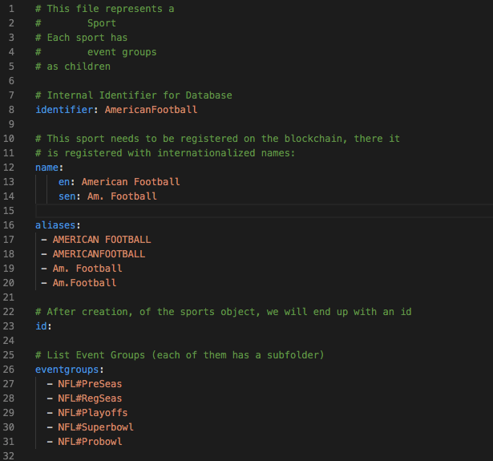

# BookieSports

BookieSports is a module that contains the management information for BOS. This management information describes the sports, event groups, events, betting market groups \(BMGs\) and markets that are used to be used by Bookie. 

The files have multi-token support so all of the above data sets can be created differently for each token.

The configuration files are all in YAML format and the number of files varies according to the sports and events groups and teams supported.

The following is an example of a YAML file used for American Football:

The configuration files would need updating several times a year as it's not known long in advance what teams will be in certain leagues, or in the playoffs and also new sports or tokens could be added along with additional event and betting market groups. 

for more details on the BookieSports schemata see:



