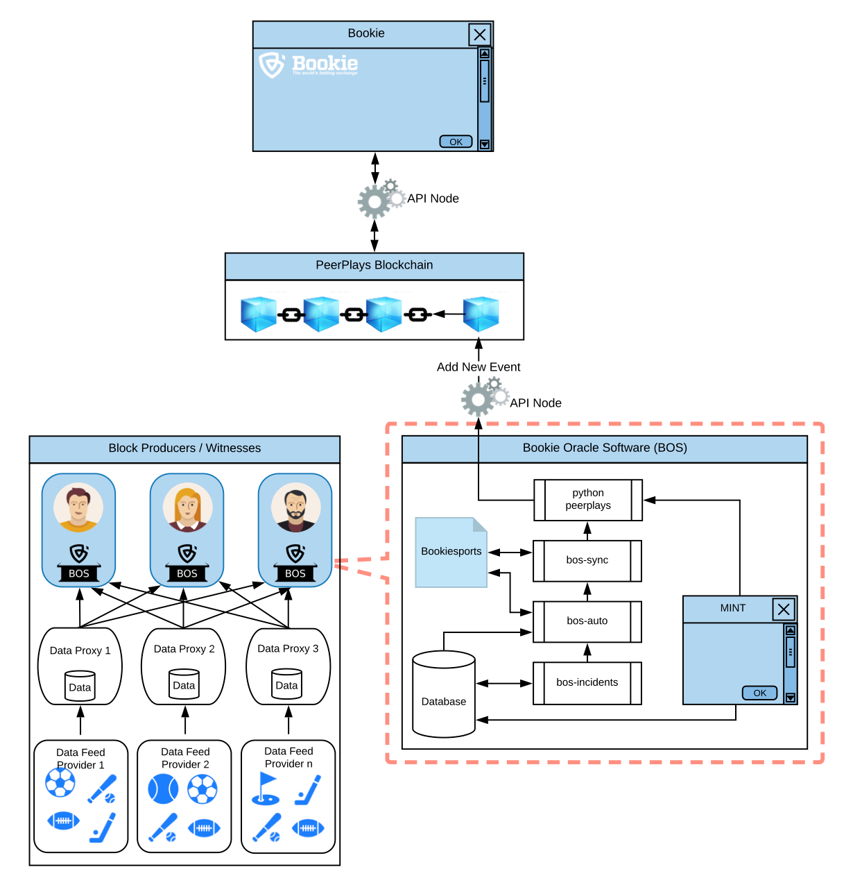

# BOS Installation

## Introduction

This document explains how the Bookie Oracle Suite \(BOS\) is installed, tested and maintained. 

Topics covered include:

* BOS Installation and testing.
* Using the command line tool.

### High Level Structure



## Installation of bos-auto

In this first step, we'll install everything we'll need going forward.

### Install Dependencies


Dependencies are installed as `root/sudo`


```text
apt-get install libffi-dev libssl-dev python-dev python3-dev python3-pip
pip3 install virtualenv
```


Note that `virtualenv` is a best practice for python, but installation can also be on a user/global level.


### Install MongoDB

MongoDB is used for persistent storage within BOS.



For  additional information on how to use MongoDB refer to tutorials on your distribution.


Make sure that the MongoDB is running reliably with automatic restart on failure.


### **Install Redis**

Redis is used as an asynchronous queue for the python processes in BOS.



For additional information on how to install Redisdb refer to  your Linux distribution.


Make sure that RedisDB is running reliably with automatic restart on failure, and that it's run without any disk persistence.


### Starting MongoDB and Redis Daemons

It is highly recommended that both daemons are started on start-up.

```text
systemctl enable mongod
systemctl enable redis
```

To start the deamons, execute

```text
systemctl start mongod
systemctl start redis
```


**Common Issues**


**Exception**: _Can’t save in background: fork or MISCONF Redis is configured to save RDB snapshots._

This indicates that either your queue is very full and the RAM is insufficient, or that your disk is full and the snapshot can’t be persisted. 

Create your own Redis configuration file \([https://redis.io/topics/config](https://redis.io/topics/config)\) and use it to deactivate caching and activate overcommit memory:

[https://redis.io/topics/faq\#background-saving-fails-with-a-fork-error-under-linux-even-if-i-have-a-lot-of-free-ram](https://redis.io/topics/faq#background-saving-fails-with-a-fork-error-under-linux-even-if-i-have-a-lot-of-free-ram) or [https://stackoverflow.com/questions/19581059/misconf-redis-is-configured-to-save-rdb-snapshots/49839193\#49839193](https://stackoverflow.com/questions/19581059/misconf-redis-is-configured-to-save-rdb-snapshots/49839193#49839193)

[https://gist.github.com/kapkaev/4619127](https://gist.github.com/kapkaev/4619127)  


**Exception**: _IncidentStorageLostException: localhost:27017: \[Errno 111\] Connection refused or similar._ 

This indicates that your MondoDB is not running properly. Check your MongoDB installation.

### Installing bos-auto as a User

You can either install bos-auto via `pypi / pip3` \(production installation\) or via git clone \(debug installation\). 

For production using install bos-auto via pip3 is recommended, but the git master branch is always the latest release as well, making both installations equivalent. Recommended is a separate user.

```text
cd ~
mkdir bos-auto
cd bos-auto
# create virtual environment
virtualenv -p python3 env
# activate environment
source env/bin/activate
# install bos-auto into virtual environment
pip3 install bos-auto
```

For debug use, checkout from Github \(master branch\) and install dependencies manually.



```text
cd ~
# checkout from github
git clone https://github.com/pbsa/bos-auto
cd bos-auto
# create virtual environment
virtualenv -p python3 env
# activate environment
source env/bin/activate
# install dependencies
pip3 install -r requirements.txt
```

BOS auto is supposed to run in the virtual environment. Either activate it beforehand, as above, or run it directly in the `env/bin` folder.

### Upgrading bos-auto as a User

For production installation, upgrade to the latest version - including all dependencies using:

```text
pip3 install --upgrade --upgrade-strategy eager bos-auto
```

For debug installation, pull latest master branch and upgrade dependencies manually

```text
git pull
pip3 install -r requirements.txt --upgrade --upgrade-strategy eager
```

Next we need to go through the  steps required to setup bos-auto properly.



After bos-auto configuration we need to spin-up bos-auto to see if it works properly. 



### **Manual Intervention \(MINT\)**

Bos-mint is a web-based manual intervention module that allows you to work with all sorts of manual interactions with the blockchain. 

For more information see:



Monitoring bos-auto

The isalive call should be used for monitoring. The scheduler must be running, and the default queue a low count \(&lt; 10\).

Here is an example of a positive isalive check:

```text
 {
   "background": {
      "scheduler": True
   },
   "queue": {
      "status": {
         "default": {
            "count": 0
         },
         ...
      }
   },
   ...
}
```

## [Bookied](https://bos-auto.readthedocs.io/en/latest/index.html)

#### Navigation

* [Setup of Bookie Oracle Suite](https://bos-auto.readthedocs.io/en/latest/installation.html#)
  * [Overall Structure](https://bos-auto.readthedocs.io/en/latest/installation.html#overall-structure)
  * [Installation of bos-auto](https://bos-auto.readthedocs.io/en/latest/installation.html#installation-of-bos-auto)
    * [Install dependencies \(as root/sudo\)](https://bos-auto.readthedocs.io/en/latest/installation.html#install-dependencies-as-root-sudo)
    * [Install databases \(as root/sudo\)](https://bos-auto.readthedocs.io/en/latest/installation.html#install-databases-as-root-sudo)
    * [Install bos-auto \(as user\)](https://bos-auto.readthedocs.io/en/latest/installation.html#install-bos-auto-as-user)
    * [Upgrading bos-auto \(as user\)](https://bos-auto.readthedocs.io/en/latest/installation.html#upgrading-bos-auto-as-user)
  * [Configuration of bos-auto](https://bos-auto.readthedocs.io/en/latest/installation.html#configuration-of-bos-auto)
    * [Setup your python-peerplays wallet](https://bos-auto.readthedocs.io/en/latest/installation.html#setup-your-python-peerplays-wallet)
    * [Funding the account](https://bos-auto.readthedocs.io/en/latest/installation.html#funding-the-account)
    * [Modify configuration](https://bos-auto.readthedocs.io/en/latest/installation.html#modify-configuration)
  * [Spinning up bos-auto](https://bos-auto.readthedocs.io/en/latest/installation.html#spinning-up-bos-auto)
    * [Start the Endpoint](https://bos-auto.readthedocs.io/en/latest/installation.html#start-the-endpoint)
    * [Start worker](https://bos-auto.readthedocs.io/en/latest/installation.html#start-worker)
  * [Monitoring bos-auto](https://bos-auto.readthedocs.io/en/latest/installation.html#monitoring-bos-auto)
* [Configuration](https://bos-auto.readthedocs.io/en/latest/config.html)
* [Command Line Tool](https://bos-auto.readthedocs.io/en/latest/cli.html)
* [Schema](https://bos-auto.readthedocs.io/en/latest/schema.html)
* [Web Endpoint](https://bos-auto.readthedocs.io/en/latest/web.html)
* [Worker](https://bos-auto.readthedocs.io/en/latest/worker.html)
* [bookied package](https://bos-auto.readthedocs.io/en/latest/bookied.html)

#### Quick search

[](https://readthedocs.org/sustainability/click/638/GrisbekTMOmL/)[Beat Triplebyte's online coding quiz. Get offers from top companies. Skip resumes & recruiters.](https://readthedocs.org/sustainability/click/638/GrisbekTMOmL/)[_Sponsored_](https://readthedocs.org/sustainability/advertising/) _·_ [_Ads served ethically_](https://docs.readthedocs.io/en/latest/ethical-advertising.html)©2017, Fabian Schu

