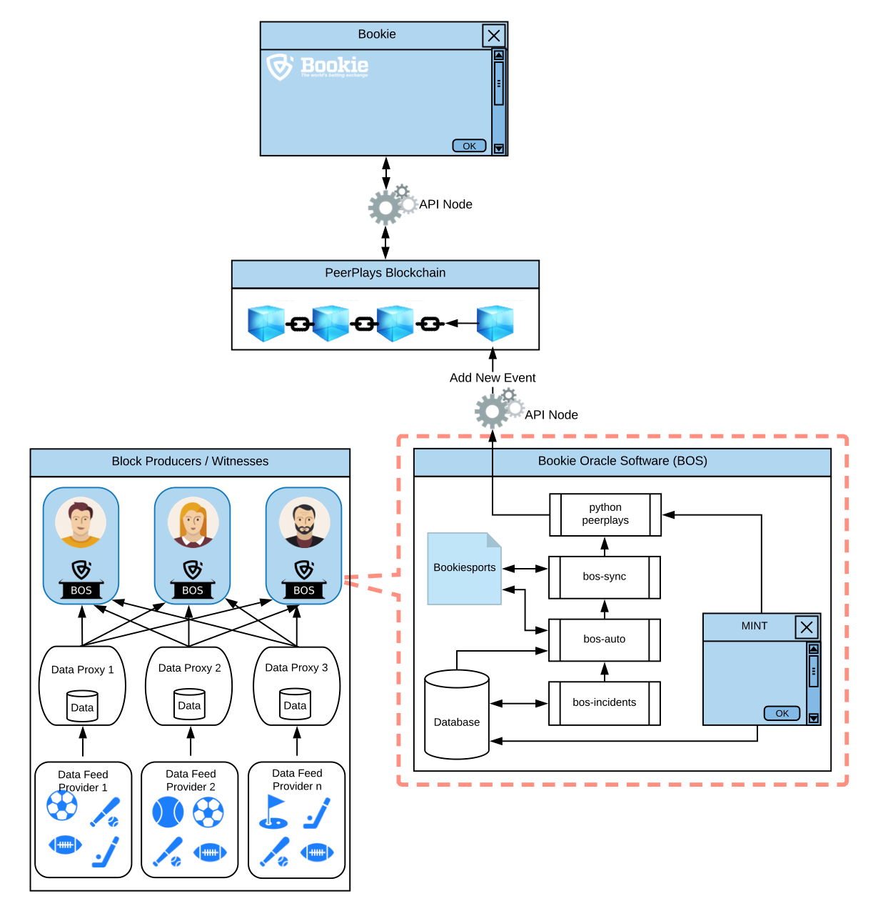

# Introduction to BOS

The Bookie Oracle System, or BOS, is a unique decentralized sports feed oracle system originally designed for the BookiePro dApp.

Unlike traditional centralized sports betting application that rely on perhaps one or two data feeds, Bookie through BOS has the potential for almost unlimited data feeds through the use of data proxies.

At its simplest, a data proxy is just middleware that consumes it's own data feed \(usually from a commercial supplier\)

## High Level Structure

## 

