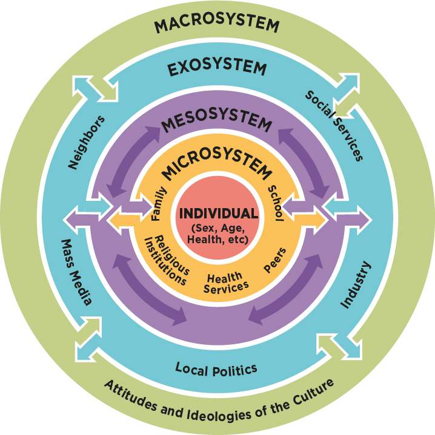

# Decentralization

## 1. What is Decentralization?

You've been hearing the word **decentralized** being thrown around. What does it mean?

Decentralization refers to the transfer of control of an activity or organization to several local offices or authorities rather than one single entity. This can be ambiguous because "several" can refer to anything from as few as three to as many as there are members of an organization (like multiple boards of directors vs. every single member of the organization.) In many organizations, this can create a smoke screen where the perception of freedom is created to hide the real aim of the organization; control for the few. The more decentralized the organization, the greater capacity there is for its members having control. In order to assess the level of control we will have when joining an organization that claims to be decentralized, we must assess the organization’s methods of decentralization.

## 2. Quantifying Decentralization

Examine the level to which the organization has dispersed its control. First, how many modes of power have been decentralized and to what extent has each mode been decentralized? To judge the number of modes, we must understand these modes and the impact that they have on an organization. These modes are decision making, narrative, enforcement, and innovation.

### 2.1. Decision Making

Decision making refers to the ability to choose and implement avenues of change within bounds. This could mean the day-to-day decisions in each department, which has generally been the role of employees and managers within centralized systems. The power to make decisions extends to the highest level of the organization. Decision making determines how money is obtained, how it is distributed, which solutions are attempted, which risks are considered worth taking, how compensation is determined, and so on.

Much of the decision making power in centralized systems have been delegated across departments with a single party or small group of parties responsible for the implementation of suggestions made by each of these departments. For example, a human resources department may assess the compensation needs of all employees based on department and employee generated criteria and then propose a compensation and benefits package that every member of the organization would find fair. If, however, this package were to be vetoed by the CEO of the organization, the implementation of this package would not occur.

In a fully decentralized system, each employee would be asked for input, the suggestions would be compiled into a cohesive package and assessed for feasibility, and implemented once a sustainable agreement was found without the backing of a higher authority. While this may seem time consuming due to the need for negotiation among those providing opinion, ultimately the result of such negotiations allows each member to take ownership, feel valued, and have the opportunity to understand the reasoning for decisions. In this way, discontentment among staff is avoided and the organization has the support of all of its members.

### 2.2. Narrative

The narrative of an organization is the union of several pieces of human generated experience.

* First, it is made of organizational data.
* Second, it is made of the value system, mission statement, and goals of the organization as a whole.
* Third, it is made of the values and goals of each individual member of an organization, including those that are never voiced (For example: plans for furthering education, competition among members, personal problems, etc.)
* Fourth, it is made of communication.

To truly understand narrative and its impact on an organization, it can be helpful to think of Ecological systems theory developed by Urie Bronfenbrenner (see Figure 1 & [Appendix A](decentralization.md#appendix-a)). While Bronfenbrenner’s theory relates to the development of people, an organization will be treated as an individual within public consciousness. Its development must be treated as any other individual, with the understanding that it too is made of individuals.

Both the narrative of each member and the narrative of the organization as a cohesive whole acting as an individual in the public sphere must be taken into account when control is considered. Errors in representation are always made when a group is unable to speak for themselves. The perception of individuals within a group and the group as a whole will come from how those outside the organization receive the narrative. The narrative of the organization as a whole will also create the perception of its members. To control the narrative is to control how you are seen. A negative perception at any level helps no one, and is often a source of much anger, resentment, and embarrassment among those who do not feel accurately represented. Representation matters.

### 2.3. Enforcement

Enforcement is the act of compelling observance of or compliance with a law, rule, culture, or obligation. The control of enforcement must be given careful consideration. In a centralized system, there is always a bottom tier that has no power to enforce, and no one has authority of the top tier outside of state and national law. While those without punitive authority are able to report to those higher or provide feedback to each other, they ultimately do not have the power to ensure that every member of their group is abiding by the established rules and culture. More often than not, only those at the highest level of the authoritative hierarchy are able to set rules and devise the means by which these rules are to be enforced. A lack of enforcement means that a rule is not taken seriously, and is therefore not a rule. Too much enforcement can generate fear and distrust of authority figures, which can negatively impact performance in a variety of ways.

The alternative to this hierarchical approach is to encourage as much organizational ownership as possible to the creation and enforcement of rules and organizational culture as possible. In an article published at [tribeculturechange.com](https://tribeculturechange.com/how-to-make-people-follow-the-rules/), Lizz Fields-Pattinson promotes the idea that "when we have a stake in how we’re supposed to approach the world around us, we feel a sense of social belonging and alignment with the people who share that world-view," so it is beneficial to "involve more people in the decisions which affect rules or codes of conduct from the start, that way you encourage a larger number of engaged advocates to back your cause." This is echoed by Market Business News: "People feel motivated to follow through when they feel that they are part of the program."

While it may still be necessary within an organization to have an authority group that is charged with enforcement, there are ways to decentralize this mode of control so that there is no hierarchy. For example, in the beginning stages of the formation of rules and consequences, all member should be invited to share their vision of the standard by which operations are to be run and what should be the consequence for an individual that does not follow the standard. Once a code of conduct and levels of intervention have been established, a review process can occur within set cycles to ensure that new members have an opportunity to weigh in and necessary changes to the system can be established and implemented. To ensure that all members are held accountable, delegates can be chosen for a disciplinary committee on a rotational basis on which all individuals have the opportunity to serve. Team managers can be chosen based on experience and training criteria, but also be subject to peer review by those they manage. In a system such as this, all members have the opportunity to provide and receive feedback, and no one is in a strictly subordinate role.

### 2.4. Innovation

Innovation refers to the development of something new. This applies to products, but also any idea, method, or procedure at any level within the organization. In general, the control of innovation has everything to do with who is given the authority to try new things and to make suggests. In a typical centralized organization, innovation is reserved for specific departments and the categories of thought are siloed. Consider that human resources, research and development, manufacturing, and marketing often have no need to communicate, yet individuals within every department are affected by the ideas generated by each group. Also consider that individuals may have expertise separate from their job role. For example, a member of the production line may be obtaining a social work degree and therefore generate an idea that could be useful to human resources. If there is no means by which these ideas can easily be shared, they likely will not be. A suggestion box is only useful when the ideas within are actively considered.

## 3. What does this mean for me?

In a centralized system, primary decisions are made by the person or group at the very top of the organization, such as a board of directors or a CEO. To move away from this model, an organization may begin to allow latitudes to "lower" levels of the organization, but maintain functions such as research, development, and records keeping for the highest levels of the organization. So, even if basic decision making is now shared throughout the organization, the upper levels maintain control of innovation and any long-term changes are not easily accessible to those who have the power of basic decision making.

While blended systems such as these seem to allow freedom, those with voting power can only choose those options they believe are available to them. Consider that daily decisions may be short lived and have little impact on the direction of the company. Without the ability to innovate, the future direction of the company is still controlled by a central group. The suggestions leading to innovation will be generated by research and development which, being controlled by a centralized group rather than open to all, are funneled. Any decisions therefore are controlled by a central group.

The same is true for the control of narrative, especially by way of data and information regarding changes within the organization. Consider an organization’s turn over. If those involved in decision making are gradually replaced by others over time, those new to the organization will only know of what has recently come to pass without the ability to access all records. If the records are maintained by a central group, again there is the concern of funneling. When documentation is restricted, openness is jeopardized, as is timeliness. Further, a single copy of historical records is subject to corruption. Any changes made, whether accidental or intentional, will have no basis of comparison. If, however, every person with power of decision were to have their own copy of all documentation records, access will be automatically granted and immediate, and discrepancies will become apparent between copies.

When all aspects of an organization are fully decentralized, there is no limit to its innovative potential. Rather than suggestions being funneled from a centralized viewpoint. Each member is free to make suggestions relative to their perspective within the organization. Each suggestion may be assessed for utility by all those with power of decision and implemented with expediency. There is no need to wait for approval from a centralized power. Majority support cannot be overturned by a single voice. Once accepted and initiated, it will be up to market trends to decide outcomes. Counter-changes can be made just as quickly if market trends show a need. This flexibility in innovation allows for timely adjustments and increases the likelihood for rapid growth and success.

Likewise, the increased access of information allows for better integrity within the organization. Consider the human dynamic within organizations. While no one wants to think the worst of an organization’s members, mistakes will happen and people can give into temptation. In a centralized system of records keeping, it is up to a single group to catch all errors or intentional fudging. When there is no basis of comparison, it can take time to reconcile places where figures do not make sense. The more transactions occur, the longer it can take.  When information is decentralized, however, there is a large basis for comparison and every individual with a copy has the ability to compare with others. Discrepancies are far more noticeable. If a single copy varies from the others, it becomes easier to fix and easier to trace its source. Unless each copy where to be simultaneously corrupted, there would be no way to hide a discrepancy. Since each copy is housed separately, it would be nearly impossible to effect a change across the entirety of records. The contents of the documentation are therefore trustworthy.

It is only when all aspects of an organization are delegated that an organization can truly claim to be decentralized.

## Appendix A

Ecological systems theory was developed by Urie Bronfenbrenner. The six systems described in his theory, and outlined in Figure 1 (above) are as follows:

**Individual** (or Organization): **** This can represent a member of the organization or the organization itself, depending on the context.

**Microsystem**: Institutions and groups that most immediately and directly impact the individual's development.

**Mesosystem**: Consists of interconnections between the microsystems. For example, interactions between different departments within the organization that will impact the individual.

**Exosystem**: Involves links between social settings that do not involve the individual, yet have an impact on the individual. For example, the experiences of other organizations within the same industry.

**Macrosystem**: Describes the overarching culture that influences the developing individual, as well as the microsystems and mesosystems embedded in those cultures. Cultural contexts can differ based on geographic location, socioeconomic status, poverty, and ethnicity. Members of a cultural group often share a common identity, heritage, and values. Macrosystems evolve across time and from generation to generation.

**Chronosystem** (not pictured): Consists of the pattern of environmental events and transitions over the life course of the individual, as well as changing socio-historical circumstances.

