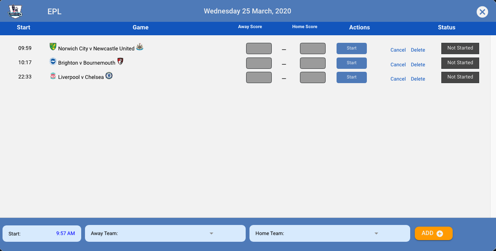
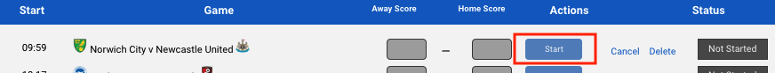
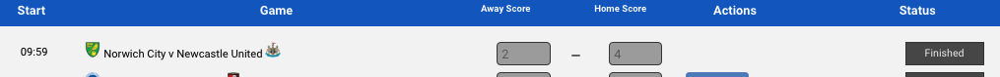

# Game Selector

The Game Selector is opened by clicking on the day cell of any calendar. The Game Selector is the engine behind all of the games that are created and then posted to the Bookie Oracle System and on to BookiePro.

The Game Selector is opened when you click on any day cell on the [Calendar](dashboard/#calendar).

The Game Selector is used for creating new games and then starting then, adding scores and finally finishing them.

You can also use the Game Selector to Cancel or Delete games.

## Adding a Game

To add new game use the input fields at the bottom of the screen and then click on the `ADD` button.

The Away Team and Home Team dropdown lists will only display valid teams for the selected sport / league combination.

It is permitted to add a start time that's in the past as a game could start earlier than expected. However, if this is the case then the game needs to be [started](game-selector.md#start-game) as soon as possible.


**Note**: There is no check on whether the same match is added twice. The reason for this is that in some sports it's common to have a 'double-header', so two matches on the same day is perfectly acceptable.



**Note**: The score input fields are disabled until a game is started.


As soon as a the game is added you'll see it in the game list with any other games scheduled for the same day.

## Starting a Game

To start a game click on the `Start` button next to the game in the game list. The game status will change to `In Progress`


**Important**: You must start a game as close as possible to the **ACTUAL** start time of the game; games seldom start at the scheduled time. This is the time that's recorded as the 'whistle start time' and the time that BOS will compare with start times reported by other data proxies.


Once a game has started you can't [delete](game-selector.md#delete-game) it, but you can still [cancel](game-selector.md#cancel-game) it.

## Finishing a Game

To finish a game enter the score for both home and away teams and click on the `Finish` button next to the game. The game status will  change to `Finished`


**Important**: You must finish a game as close as possible to the **ACTUAL** time that the game finishes. This is the time that's recorded as the 'whistle end time' and the time that BOS will compare with finish times reported by other data proxies.


Once a game is finished it's no longer possible to cancel it.


**Note**: It's important that scores are entered correctly the first time as it's not possible to correct scores and re-submit them. 


## Canceling a Game

You can cancel a game as long as it's either in a `Not Started` or `In Progress.` status.

To cancel a game click on the `Cancel` text next to the game. 

A confirmation message similar to the following will be shown. 

Click on `Yes` to cancel the game \(game status will then change to `Canceled)` or `No` to to return without canceling.

A `canceled` message will be sent to BOS.


**Note**: A canceled game can also be interpreted as postponed but not as delayed. A delayed game is expected to restart. But once a game has been canceled it can't be restarted. If a game is canceled and then played the following day it would have to re-created with the new start time.


## Deleting a Game

A game can only be deleted if it hasn't been started \(has a status of `Not Started`\).

To delete a game click on the Delete text next to the game. 

A confirmation message similar to the following will be shown:

Click on `Yes` to delete the game \(game will be removed\) or `No` to to return without deleting.

If you delete a game then a `canceled` message will also be sent to BOS so that BOS can tag the game in the same way as a canceled game.


**Note**: The difference between a canceled game and a deleted game is that a deleted game is basically a game that was entered in error and once deleted is removed from the database so it can be re-entered correctly if needed. A canceled game is a game that for one reason or other doesn't take place after being created.


