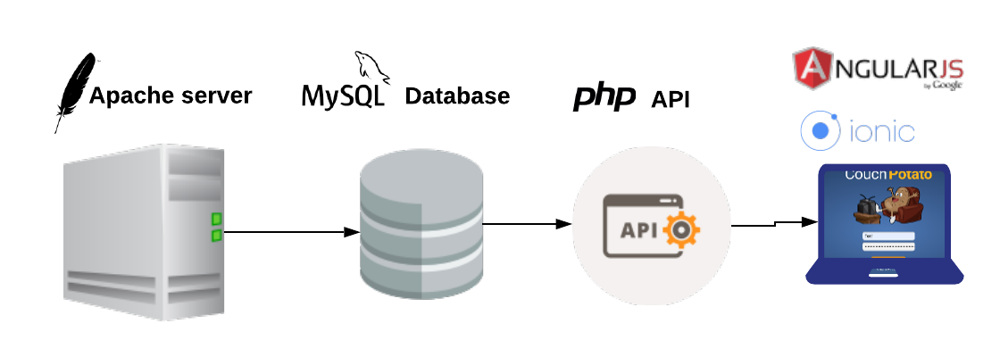

# Installation

This document explains the  Couch Potato server installation as both "The long way" and "The short way"

The document does assume some prior knowledge of simple web server installation.

## The Stack

Couch Potato front-end is an Ionic web application using the Angular framework. It interfaces with the back-end through a PHP API that provides connectivity to a MySQL database,



Although the diagram above shows an Apache server, other servers compatible with PHP and MySQL could be used, such as Nginx.

## Installing - The Long Way

These short steps show how to install all the back-end components and dependencies.

### Step 1 - Install a PHP / MySQL Server

There are several open source PHP stacks readily available that are by far the easiest way of getting set up and include MySQL as well. The most popular being WAMP and LAMP. 

These stacks, and installation instructions,  are readily available for download from many sources and won't be covered any further here.

### Step 2 - Update versions

At the time of writing the PHP and SQL versions used are:

* PHP 7.2
* MySQL 5.7

After installing PHP and MySQL if your versions aren't at least as new as these then they need to be updated.

The process for updating varies according to the operating system, but if PHP and MySQL were installed as a stack in Step 1, such as LAMP, then as long as that was the most recent version there shouldn't be an issue with old versions of PHP or MySQL.

### Step 3 - Install PHP Dependencies.

The Couch Potato API additional libraries that either aren't part of the standard installation and need to be loaded, or are in PHP but haven't been enabled.

#### mysqli

This is the PHP-&gt;MySQL library used by the API. For installation instructions see:



### Step 4 - Run MySQL Script

A script will be provided to all new Couch Potato operators that will  create the database schema and pre-populate the database with all the starting data.


**Important**: After the script is run you should have a new database schema called couch\_potato. To avoid any issues or additional configuration changes don't change the database name.


Run the script on the MySQL database instance created in the previous steps.

### Step 5 - Add Database Connection to API

The PHP API must be updated with the correct database connection credentials that were used to create the database. To do this the .env variables need to be changed as follows:

Open the .env file from the root location where the PHP API was loaded.

```text
DB_HOST=" "
DB_USER=""
DB_PASS=""
DB_NAME="couch_potato"
```


