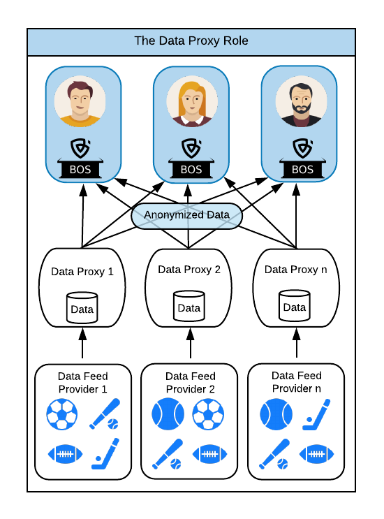

# Introduction to Data Proxies

## Overview

The Data Proxy serves as a middle man between the Data Feed Providers \(DFPs\) and the Bookie Oracle System \(BOS\) operated by the Witnesses. 

The simplest way to understand this relationship is knowing that as BOS requires all data it receives to be parsed/ normalized to the exactly the same format, a process needs to exist to make this happen. This 'process' is the data proxy.

Each DFP provides data on sports events in some format, but no two DFPs might use the same format, or necessarily support the same sports and events. Both Data Proxies and BOS use the [Bookiesports](../bookie-oracle-suite-bos/bookiesports/) module to manage this common format and ensure the consistency of data, regardless of how many Data Proxies are operating.

The normalized data is then sent to the subscribed Witnesses.

## Decentralization of Data

Popular sports betting, analysis and reporting sites are usually just tied to single data feed provider. This is fine for what they're doing because they're not claiming to be decentralized, or provably fair.

But as BookiePro is the world's first decentralized sports betting exchange it's important that the decentralization includes the \(sports\) data feeds. BookiePro achieves this through the combination of independent BOS subscribers \(Witnesses\) and a diversity of Data Proxies. Each Data Proxy then further decentralizes the data by using a separate Data Feed Provider.

As we see in the diagram above, no two Data Proxies ever share the same DFP. However, each instance of BOS subscribes to all Data Proxies so that BOS ensures that no Incident is ever processed without a consensus from the all the Witnesses. This means that through the combination of the Data Proxy architecture and the magic of BOS, there is no single source of data for any BookiePro Incident.

It's impossible for BookiePro to record that "team A beat team B" based on only a single piece of information.



## 

