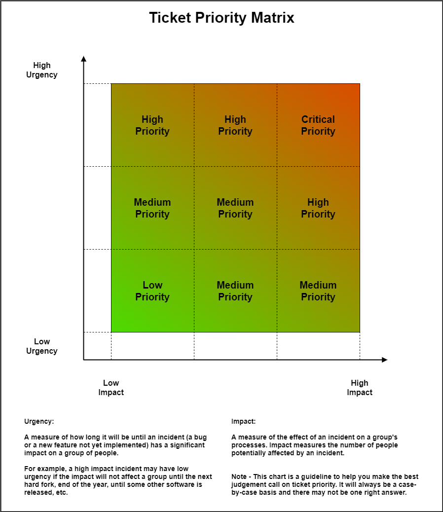

# GitLab Ticket Templates

## 1. Overview

The following templates help document tickets (issues) in GitLab. They are a starting point and reference for anyone unfamiliar with the ticketing process. There are two main templates given here; one for reporting bugs, and one for the implementation of a User Story (new feature).


**Required** fields listed below may not be required (strictly speaking) in GitLab when submitting a new ticket. The information in these fields are required for our team to handle bug fixes and new features with speed and efficiency. A few extra minutes of your time now can save the team hours or days in the long run.


## 2. Bug Tickets

A **bug** is a defect in something that already exists. When found, bugs need to be documented in tickets to be tracked like any other work item. Bugs are unique in that they can be difficult to reproduce, have obscure root causes, and may not present themselves in all contexts. This is why providing detailed tickets is key to solving these issues.

Key Elements of a Bug ticket:

1. **Title** (Required): Short title that clearly states the Bug.
2. **Type** (Required): `Issue` (for general work) or `Incident` (For investigating IT service disruptions or outages).
3. **Description** (Required): Detailed enough so that QA does not need to ask questions in order to test the ticket. This should include the following sections:
   1. Description: Describe the bug.
   2. Preconditions: If necessary in order to run the Scenario steps properly.
   3. Affected Version(s): If known, list the build(s) where the issue has been observed.
   4. Scenario: The steps to reproduce the issue. Should be clear, direct, and have enough details to be reproducible.
   5. Current Bugged Behavior: The observed issue as it actually happens.
   6. Expected Correct Behavior: The requirements that describe a successful outcome. Simply, what _should_ happen.
   7. Attempted Fixes: What has already been done to try to solve the issue, and the results of the attempts.
   8. Possible Fixes: If possible, link to the line of code that might be responsible for the problem. Or list other insights into the problem.
   9. Attachments: This is the visual proof (screenshots, logs, video, etc.) of the existing issue. Any other useful information should be attached as well.
   10. Quick Actions: If necessary, use quick actions to relate issues to this ticket. (`/relate #issue1 #issue2`) See [Quick Actions](https://docs.gitlab.com/ee/user/project/quick\_actions.html#issues-merge-requests-and-epics) for more info.
4. **Assignees**: If known, adding the appropriate individual(s) here will save time.
5. **Weight**: Estimate of the effort needed to solve the issue. See [Time Tracking > Weight](https://community.peerplays.tech/gitlab/time-tracking#weight) for more info.
6. **Epic**: If known, select the best related epic.
7. **Due Date**: Can be left blank. It's useful if the issue is blocking something with a deadline.
8. **Milestone**: If known, select the best related milestone.
9. **Labels** (Required): The following _three label types_ must be provided, but others can be added if necessary. See [Labels > Scoped Labels](https://community.peerplays.tech/gitlab/labels#scoped-labels) for more info.
   1. Priority: (low, medium, high, or critical) see the chart in [Appendix A](gitlab-ticket-templates.md#appendix-a-determining-ticket-priority) for help deciding the priority level.
   2. Type: bug (in the case of this template!)
   3. State: pending (for new tickets)

## 3. User Story / Implementation of a New Feature

A **user story** is a simple way to describe features that need to be implemented (and does not yet exist). The template below is built to help fully describe the task(s) that needs to be completed to satisfy the requirements of a user story. In this case, a user story may be an improvement, a previously missed requirement or functional spec, or even a brand new feature.

Key Elements of a User Story:

1. **Title** (Required): Short title that clearly states the User Story.
2. **Type** (Required): `Issue` (for general work) or `Incident` (For investigating IT service disruptions or outages).
3. **Description** (Required): A clear explanation of the required story's content so that QA does not need to ask questions in order to test and close the story ticket. Additional notes are welcome. This should include the following sections:
   1. Description: Describe the user story.
   2. Affected Version(s): If necessary, list the build(s) where the issue applies.
   3. Acceptance Criteria: The clear definition of the final solution. What does the goal look like?
   4. Attachments: If helpful, provide screenshots, logs, video, diagrams, documents, etc. pertaining to the issue. Any other useful information should be attached as well.
   5. Quick Actions: If necessary, use quick actions to relate issues to this ticket or provide a time estimate. (`/relate #issue1 #issue2`) See [Quick Actions](https://docs.gitlab.com/ee/user/project/quick\_actions.html#issues-merge-requests-and-epics) for more info.
4. **Assignees**: If known, adding the appropriate individual(s) here will save time.
5. **Weight**: Estimate of the effort needed to solve the issue. See [Time Tracking > Weight](https://community.peerplays.tech/gitlab/time-tracking#weight) for more info.
6. **Epic**: If known, select the best related epic.
7. **Due Date**: Can be left blank. It's useful if the issue is blocking something with a deadline.
8. **Milestone**: If known, select the best related milestone.
9. **Labels** (Required): The following _three label types_ must be provided, but others can be added if necessary. See [Labels > Scoped Labels](https://community.peerplays.tech/gitlab/labels#scoped-labels) for more info.
   1. Priority: (low, medium, high, or critical) see the chart in [Appendix A](gitlab-ticket-templates.md#appendix-a-determining-ticket-priority) for help deciding the priority level.
   2. Type: feature (in the case of this template!)
   3. State: pending (for new tickets)

## Appendix A - Determining Ticket Priority

The priority of a ticket depends on a mix of aspects. Applying a priority is subjective. But we can help classify the priority by thinking in terms of impact and urgency:




Ticket Priority Matrix (Draw.io XML)


## Appendix B - Copy / Paste Description Templates

### Bugs

Here is a template that you can quickly copy and paste into the Description field in the new GitLab bug ticket. This one has information to help guide you when entering information into the ticket.

```
## Description

(Required) Describe the bug here.

## Preconditions

(If necessary) In order to run the Scenario steps properly, list any preconditions.

- Precondition A
- Precondition B

## Affected Version(s)

(If known) List the build(s) where the issue has been observed.

- Build A
- Build B

## Scenario

(Required) The steps to reproduce the issue. Should be clear, direct, and have enough details to be reproducible.

1. Step 1...
2. Step 2...
3. Step 3...

## Current Bugged Behavior

(Required) The observed issue as it actually happens.

## Expected Correct Behavior

(Required) The requirements that describe a successful outcome. Simply, what should happen.

## Attempted Fixes

(Required, even if nothing) What has already been done to try to solve the issue, and the results of the attempts.

## Possible Fixes

(If possible) Link to the line of code that might be responsible for the problem. Or list other insights into the problem.

**Note**: Don't forget to attach any relevant files, and to use quick actions to link related issues or add time estimates. Then delete this note!

```

Or just the section headers if you prefer...

```
## Description


## Preconditions


## Affected Version(s)


## Scenario


## Current Bugged Behavior


## Expected Correct Behavior


## Attempted Fixes


## Possible Fixes


```

### User Stories

Here is a template that you can quickly copy and paste into the Description field in the new GitLab user story ticket. This one has information to help guide you when entering information into the ticket.

```
## Description

(Required) Describe the user story.

## Affected Version(s)

(If necessary) List the build(s) where the issue applies.

- Build A
- Build B

## Acceptance Criteria

(Required) The clear definition of the final solution. What does the goal look like?

**Note**: Don't forget to attach any relevant files, and to use quick actions to link related issues or add time estimates. Then delete this note!

```

Or just the section headers if you prefer...

```
## Description


## Affected Version(s)


## Acceptance Criteria


```
