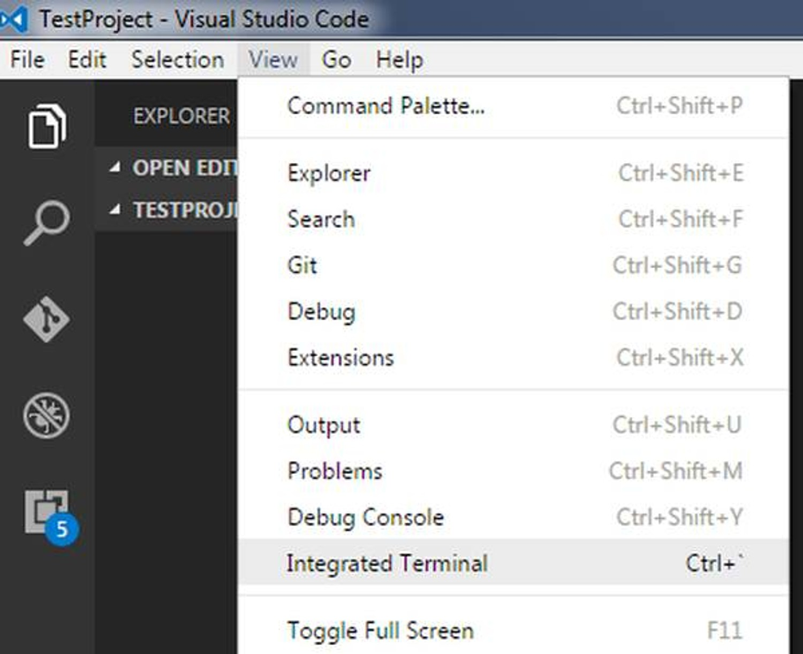

# Peerplays Developer

## Introduction

This document focus on providing the concepts, workflow, basic process for a newly onboarded developer. The detailed description of each categories are summarized in a single page to provide easy navigation and access to the desired topic.&#x20;

## [Development workflow](https://devs.peerplays.com/development-workflow-docs/development-workflow)

The workflow guides the developer to learn the process followed by the team. The workflow mainly focus on ticket creation and progress involved in the life cycle of any issue. The various stages of a ticket under the labels can be categorized as accepted, in-progress, in-review, blocked, on-hold, testing, completed. As the work progress, the labels has to be modified based on ticket completion. Click the heading to learn in detail about the development workflow.

## Basic requirements

As a newbie, there are certain concepts that are significant in starting as a developer in Peerplays. To begin with, there are three major notion that to be grasped to build any project under Peerplays. The list of three concepts are,

1. Setup a Local Testnet
2. Deploy a project with docker
3. Clone and build a project

## 1. Setup a Local Testnet

### What is a Testnet?

A test blockchain used by developer to experiment with new ideas without disturbing or breaking the main software.

The local testnet is a private testnet used for troubleshooting network issue, experimenting new ideas, or developing new dApp on a chain with complete access and control over the testnet. The testnet can be customized based on the user's requirement to perform any desired operation. To begin as part of development team, build a private testnet is the first phase to learn, experiment and explore the various features of Peerplays.

### [Steps to Install Testnet](https://infra.peerplays.com/advanced-topics/private-testnets/private-testnets-manual-install)

Click the above link to learn the detailed instructions involved in installing a private testnet. The glimpse of steps are highlighted in the below section. &#x20;

1. Check for the hardware requirements and install required software.
2. Install library for common development tasks. In Peerplays, Boost is used as a comprehensive C++ library to begin with any task.
3. Install Peerplays&#x20;
4. Generate a Genesis config file and edit the file with necessary changes to complete the testnet setup
5. Run the witness\_node
6. Run the cli\_wallet
7. Setup a second node

## 2. Deploy a project with Docker

To set-up a SON and witness node a pre-configured Docker container is necessary.&#x20;

### A. SONs - Sidechain Operator Nodes

**Sidechain Operator Nodes** - SONs facilitate the transfer of off-chain assets (like Bitcoin, Hive, or Ethereum tokens) between the Peerplays chain and the asset's native chain. These nodes often run the Peerplays node software and node software of other chains.

New to SONs ?? Click [here](https://community.peerplays.com/technology/sidechain-operator-nodes-sons/new-to-sons) to learn in detail.

### SONs - Docker Installation

This details are provided based on the assumption that, your system is running with Ubuntu 18.04 and above.

### [Installation steps](https://infra.peerplays.com/sidechain-operator-nodes-sons/installation-guides/docker-install)

Click above link to learn each installation steps in detail. The steps involved in docker installation is outlined below.

1. Update `config.ini` with SON Account Info
2. Using the CLI wallet
3. Starting the environment
4. Installing the `peerplays:son` image
5. The Bitcoin node
6. Installing Docker
7. Preparing the Environment

## B. Witness Node - Docker Installation

A witness node runs on the Peerplays blockchain. In a Peerplays way, enter a consensus mechanism called Delegated Proof of Stake (DPOS).

Think of Delegated Proof of Stake as technological democracy; the opportunity for any PPY token holder to vote on who creates new blocks in the Peerplays blockchain; we call these block producers Witnesses, and they keep the blockchain alive.

Witnesses also have the authority to approve, or reject, any changes to the blockchain software. Their actions have an overarching impact on all PPY token holders.

New to witness?? Click [here](https://community.peerplays.com/witnesses/what-is-a-peerplays-witness) to learn in detail.

### [Installation steps](https://infra.peerplays.com/witnesses/installation-guides/docker-install)

Click above link to learn the witness node docker installation in details. The outline of installation steps are listed below.

1. &#x20;Start the Container and Vote for Yourself
2. Update `config.ini` with Witness Account Info
3. Create a Peerplays Account
4. Update the `config.ini` File
5. Starting the Container
6. Installing the Peerplays image
7. Installing Docker
8. Preparing the Environment

## 3. Clone and build a project

Cloning and forking are the two mechanism that can be opted to use the files without interrupting the main repository by making a copy of the file.

### A. Project Forking workflow

When the user has no write access for any repository, then create a fork to make a personal copy of the required repository and all of its branches in a desired namespace.&#x20;

The user can make changes in their own fork and submit the changes through a merge request to reflect them in repository.

### Steps to create fork for an existing project in GitLab

1\.  Select **Fork** on the right of project's name.

<figure><figcaption></figcaption></figure>

2\. For **Project URL**, select [namespace](https://docs.gitlab.com/ee/user/namespace/index.html) for the fork created

3\. Add a **Project slug**. This value becomes part of the URL to the fork. It must be unique in the namespace.

4\. Select the **Visibility level** for the fork. For more information about visibility levels, read [Project and group visibility](https://docs.gitlab.com/ee/user/public\_access.html).

6\. Select **Fork project**.

GitLab creates the fork and redirects to the new fork's page.

The other forking activities are,

1. [Repository mirroring](https://docs.gitlab.com/ee/user/project/repository/forking\_workflow.html#repository-mirroring)
2. [Merging upstream](https://docs.gitlab.com/ee/user/project/repository/forking\_workflow.html#merging-upstream)
3. [Removing a fork relationship](https://docs.gitlab.com/ee/user/project/repository/forking\_workflow.html#removing-a-fork-relationship)

### B. How to clone git project with Visual Studio Code ?

Cloning a project is making a copy of the files in the repository to work on the code locally and later update the changes into the original repository.&#x20;

1. Open Visual Studio Code, Go to **Top Menu -> Files -> Open Folder.**
2. Select the folder you would like to download the cloned project.
3. Go to **Top Menu -> View -> Integrated Terminal.**

<figure><figcaption></figcaption></figure>

4\. Execute **'git clone'** command with the repository path to clone in the integrated terminal.

```
git clone <url>
```

5\. If credentials are required to login, then the integrated terminal will prompt for Username and Password.

6\. The complete output will be similar to the below example,

```
C:\Projects\TestProject>git clone https://bitbucket.org/velingeorgiev/rouge
Cloning into 'rouge'...
github --credentials get: github: command not found
Username for 'https://bitbucket.org': velin.georgiev@somemail.com
Password for 'https://velin.georgiev@somemail.com@bitbucket.org':
github --credentials store: github: command not found
github --credentials store: github: command not found
remote: Counting objects: 1082, done.
remote: Compressing objects: 100% (1000/1000), done.
Receiving objects: 100% (1082/1082), 3.98 MiB | 301.00 KiB/s, done.cts:  87% (942/1082), 3.88 MiB | 299.00 KiB/s

Resolving deltas: 100% (587/587), done.

C:\Projects\TestProject>
```

7\. The cloned files will be available in the local folder

<figure><figcaption></figcaption></figure>

Click below link to learn about working with GitHub in VS code\
[https://code.visualstudio.com/docs/sourcecontrol/github](https://code.visualstudio.com/docs/sourcecontrol/github)

## Development FAQs

The basic questions such as&#x20;

1. How to generate bitcoin address?
2. How to get Test BTC?
3. How to generate public key for a bitcoin address?

and so on.,

Click the below link to find the answers,

[https://devs.peerplays.com/supporting-and-reference-docs/peerplays-development-faqs](https://devs.peerplays.com/supporting-and-reference-docs/peerplays-development-faqs)

## Related Documents

* [https://docs.docker.com/engine/install/](https://docs.docker.com/engine/install/)
* [https://docs.docker.com/engine/install/linux-postinstall/](https://docs.docker.com/engine/install/linux-postinstall/)
* [https://infra.peerplays.com/witnesses/installation-guides/manual-install](https://infra.peerplays.com/witnesses/installation-guides/manual-install)
