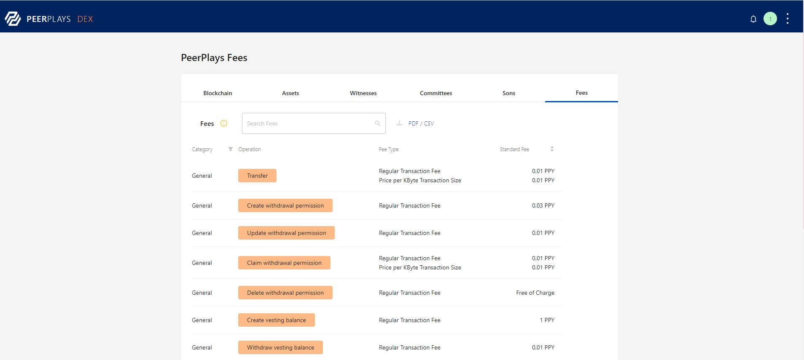

# Project Operations

## Introduction

In Peerplays, there are many applications that supports various operations viz., create, update, withdraw, delete, issue, etc., Each operation has a small cost involved to cover the network and data storage on the blockchain. The cost is calculated as PPY assets. Its advisable to plan ahead, as the fees will be accumulated based on several hundred's of operations performed.

### Operation categories

In the DEX user login page, there is a separate tab in the blocks option to feature the Fees allocated for each operation. Navigating through each category provide the list of operations falls under specific category. There are six different categories under fees section,

1. General
2. Asset specific
3. Account specific
4. Market specific
5. Business administration
6. Game specific

<figure><figcaption><p>Fees section - DEX </p></figcaption></figure>

Under each category is the list of operation with fees type and standard fees collected. Click the below link to learn the operation fees details for the selected category.

[https://nex.peerplays.com/blockchain?tab=fees](https://nex.peerplays.com/blockchain?tab=fees)

The link is live and requires user credentials to login. If there is any changes in the fees structure for any operation, it will be updated automatically.

## 1. General

As the name says General, the list of operation are common to any user and following is the list of operations under general category,

```
Transfer
Create withdrawl permission
Update withdrawl permission
Claim withdrawl permission
Delete withdrawl permission
Create vesting balance
Withdraw vesting balance
Transfer to blinded account
Blinded transfer
Transfer from blinded account
Payout affiliate
Process deposit SON wallet
Create withdraw SON wallet
Process withdraw SON wallet
Add sidechain address
```

### 2. Asset Specific

This category is specific to asset related operation. The operations are listed below,

```
Create asset
Update asset
Update smartcoin
Update asset feed producers
Issue asset
Burn asset
Fund asset fee pool
Asset settlement
Global asset settlement
Publish feed
Override transfer
Claim asset fees
Update asset dividend
Asset dividend distribution
Update betting market
Update custom account authority
Delete custom account authority
Offer
Bid
Cancel offer
Finalize offer
```

### 3. Account Specific

The type of operations under the account specific category are,

```
Create account
Update account
Account whitelist
Upgrade Account
Transfer Account
Payout referral affiliate
Create lottery asset
Purchase ticket
Reward lottery
End lottery
Clain sweeps vesting
Create nft metadata
Update nft metadate
Mint nft
Recreate SON wallet
Update SON wallet
Create deposit SON wallet
```

### 4. Market specific&#x20;

The type of operations under the market specific category are,

```
Place order
Cancel order
Update margin
```

### 5. Business Administration

The type of operations under business administration are,

```
Create witness
Update witness
Create proposal
Update proposal
Delete proposal
Create committee member
Update committee member
Global parameters update
Create worker
Custom
Asset operation
nft safe transfer from
Approve nfts
Set approval for all nfts
Create account role
Update account role
Delete account role
Create SON
Update SON
```

### 6. Game Specific

The Game specific operations are,

```
Create tournament
Join tournament
Game move
Payout tournament
Leave tournament
Create sport
Update sport
Create event group
Update event group
Create event
Update event
Create betting market rules
Update betting market rules
Create betting market group
Create betting market
Place bet
Resolve betting market group
Resolved betting market group
Adjusted bet
cancel betting market group
Matched bet
Cancel bet
Update event status
Delete sport
Delete event group
Update custom permission
```

The above list of operations helps in finding the fees for any operation under specific category.

