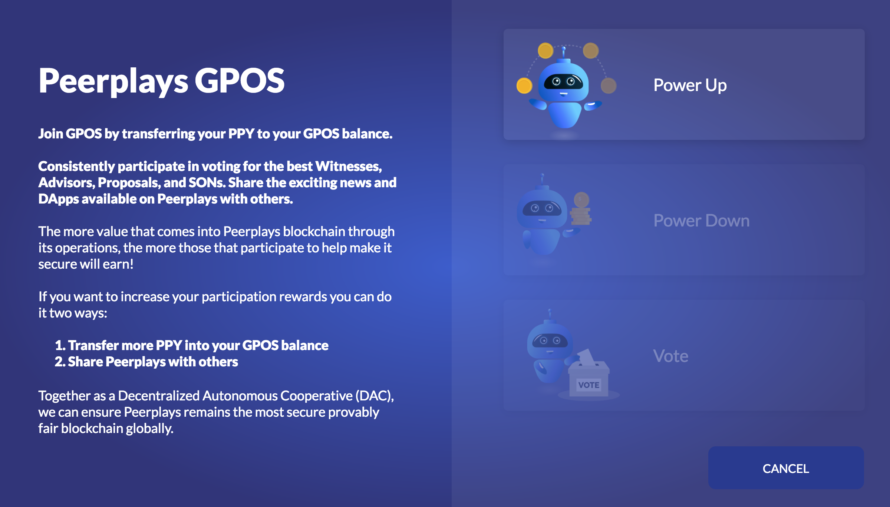

# GPOS Landing Page

The landing page is the entry point to use the different GPOS features.

## Power Up

Clicking on `Power Up` will take you to the deposit screen where you can vest PPY towards GPOS and in turn, add to your participation rewards.&#x20;

You can click `Power Up` at any time since you are free to come back and vest more PPY at your discretion.

## Power Down

Clicking on `Power Down` is very similar to `Power Up `except this time you'll be taken to the withdraw screen.

You can withdraw form your GPOS balance at any time up to the value of your balance.


**Important**: If you have a GPOS balance of zero the `Power Down` button will be disabled


## Vote

For anybody familiar with earlier versions of the Peerplays wallet, the voting section is much the same as before. Only the steps to go through to access this feature have changed.


**Important**: If you have a GPOS balance of zero the `Vote` button will be disabled

