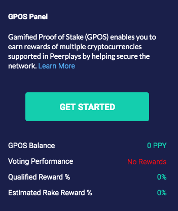
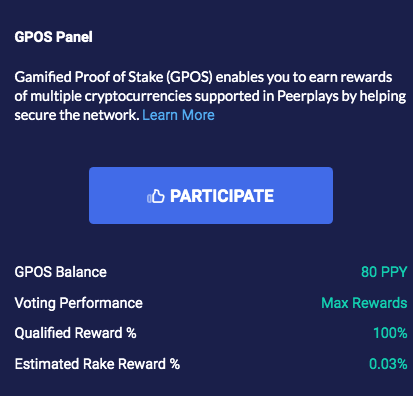

# GPOS Panel

## The GPOS Panel

The home page of the wallet now includes a panel to display your GPOS status.

The features of the panel are:

### GPOS Balance

This is the total amount of PPY that has been vested. In the above example the amount is zero which is  reflected in the Voting Performance as well.

### Voting Performance

Voting performance is calculated based on the last time you voted for either Witnesses, Advisors or Proxies. The text and colour of the caption indicates your performance according to the following table:

<table>
  <thead>
    <tr>
      <th style="text-align:left">Reward %</th>
      <th style="text-align:left">Text</th>
      <th style="text-align:left">Colour</th>
    </tr>
  </thead>
  <tbody>
    <tr>
      <td style="text-align:left">0</td>
      <td style="text-align:left">No rewards</td>
      <td style="text-align:left">Dark Red</td>
    </tr>
    <tr>
      <td style="text-align:left">1- 16.68</td>
      <td style="text-align:left">Critical low</td>
      <td style="text-align:left">Red</td>
    </tr>
    <tr>
      <td style="text-align:left">16.69 - 33.33</td>
      <td style="text-align:left">Lower rewards</td>
      <td style="text-align:left">Orange</td>
    </tr>
    <tr>
      <td style="text-align:left">33.34 - 50</td>
      <td style="text-align:left">Low rewards</td>
      <td style="text-align:left">Yellow</td>
    </tr>
    <tr>
      <td style="text-align:left">50.01 - 66.66</td>
      <td style="text-align:left">OK rewards</td>
      <td style="text-align:left">Blue</td>
    </tr>
    <tr>
      <td style="text-align:left">66.67 - 83.33</td>
      <td style="text-align:left">Good rewards</td>
      <td style="text-align:left">Dark Green</td>
    </tr>
    <tr>
      <td style="text-align:left">83.34 &lt; 100</td>
      <td style="text-align:left">Great rewards</td>
      <td style="text-align:left">Green</td>
    </tr>
    <tr>
      <td style="text-align:left">100</td>
      <td style="text-align:left">Max rewards</td>
      <td style="text-align:left">
        
Same colour as

        
other captions

      </td>
    </tr>
  </tbody>
</table>

### Get Started

Clicking on the `GET STARTED` button will begin the GPOS vesting process.

If you have a zero GPOS balance, which will always be the case if this is the first time you are using it, the button text will be `Get Started`. However, the text on the button will change to `PATICIPATE` once a balance is vested. See[ Power Up](power-up.md)

### Participate

As mentioned, this option is only available once you have a GPOS balance.

Clicking on `PARTICIPATE` will take you to the GPOS Landing Page as before, except this time both the `Power Down` and `Vote` buttons will be enabled.

