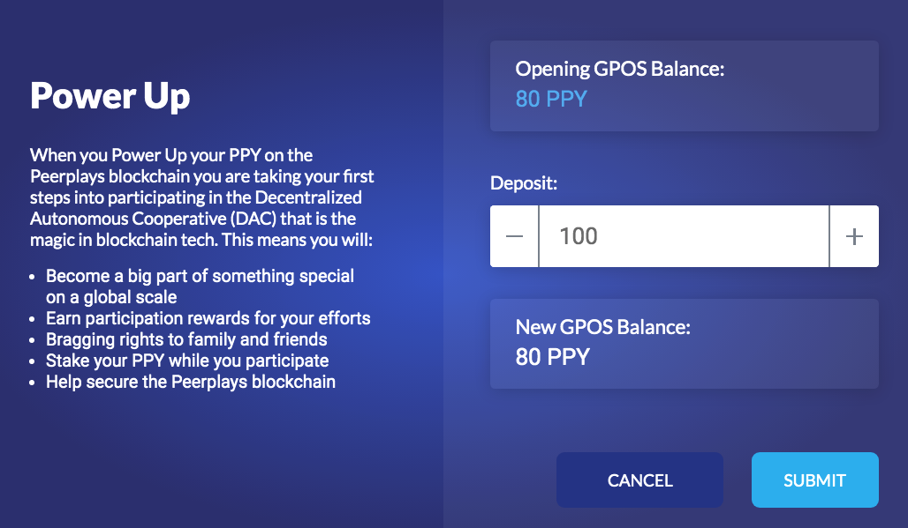

# Power Up

After clicking on the `Power Up` button on the [GPOS landing page](gpos-landing-page.md) you'll be taken to the Power Up screen; from here you can add to your GPOS balance.

The functionality of this screen is very straightforward. Simply select an amount of PPY to vest by either entering it in the Deposit field, or scroll the amount up and down using the `+` and `-` buttons.


**Important**: You might think you can vest 100% of your PPY balance to get the maximum participation rewards. However, each time you create a vested balance there is a 1PPY transaction fee. This means that you must leave at least this amount in your balance in order to perform the Power Up.


In the example above the user has no vested balance. If an amount of 80PPY is vested the New GPOS Balance will be 80PPY and if the user power's up again the Opening GPOS Balance will be 80PPY as will the New GPOS Balance.

Click on the `CANCEL` button to leave this screen without saving any changes. Or click on `SUBMIT` to save changes and return to the [GPOS Landing Page.](gpos-landing-page.md)


**Note**: Creating a GPOS balance doesn't yet qualify you to receive participation rewards, you must still [vote](vote.md).


