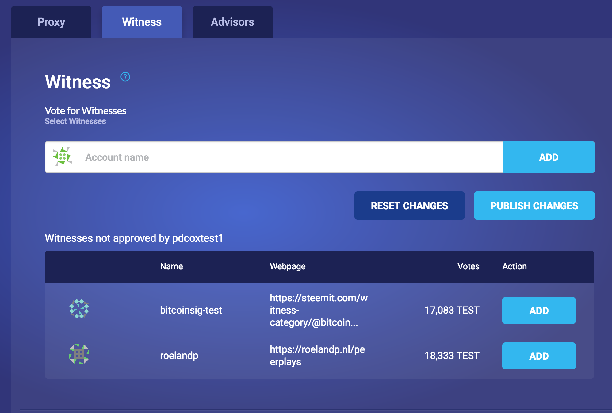
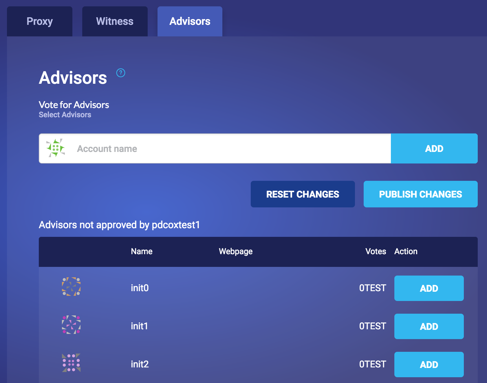

# Vote

If you have a GPOS balance then you can access the Vote screen from the [GPOS Landing Page](gpos-landing-page.md).

After clicking on the `Vote` button you'll be taken to the Vote screen from where you can vote for Witnesses, Advisors and Proxies.

The voting functionality hasn't changed from previous versions of the Peerplays Wallet so will only be documented briefly here.

## Proxy

Proxy voting allows you to select another token holder to vote on your behalf. As far as GPOS goes this still constitutes participation as you have made a commitment to the operation of the blockchain.

However, since there are participation rewards at stake, and penalties for poor voting performance, if you use this option make sure you proxy your vote\(s\) to someone reliable!

## Witness

Voting for a Witness is probably the most common use of a vote. By voting for a Witness you are playing an important role in the governance of Peerplays.

You can select one or more Witnesses from the list, or search for them, and then click `ADD` to add them to your approved list. Click `PUBLISH CHANGES` to cast your vote.

## Advisors

The Peerplays Advisors are a committee that makes decisions on software changes to Peerplays and attributes and parameters of the blockchain. They are an important part of a DPOS consensus mechanism.

Selecting an Advisor works exactly the same way as selecting a Witness.

Click on `CANCEL` to return to the GPOS Landing Page without voting, or click on `FINISH` to go to the [Thank you for voting! ](thank-you-for-voting.md)screen.

