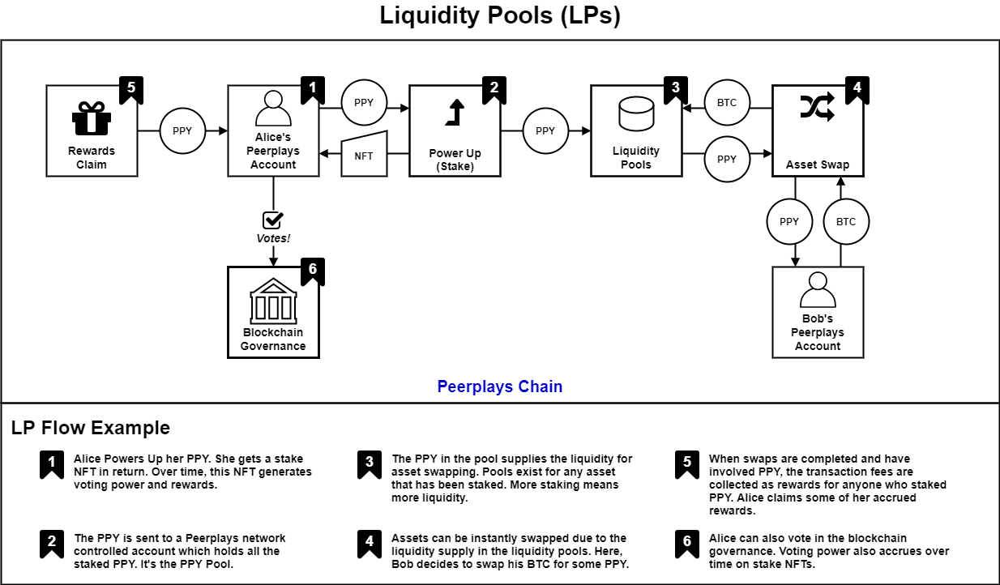

# Intro to Peerplays Liquidity Pools

## 1. Liquidity Pools

Liquidity pools \(LPs\) are designed to enable the instant swapping of various crypto assets, coins or tokens, at a price which is based on the available supply of each asset. LPs give those who are looking for an opportunity to earn rewards with the assets they own a way to do so. These asset owners supply the liquidity by staking their assets into the pool.

### 1.1. What is a liquidity pool?

In Peerplays, a liquidity pool is a network controlled asset address which is used to store the assets which have been staked to the pool. This pool is then used to facilitate the exchange of assets between interested traders. A small fee is charged to execute an exchange using the pool. The fees are then given to the people who staked to the pool in proportion to the amount of assets they have staked as rewards.

### 1.2. Get rewards by staking

When you stake assets to an LP, you receive an NFT in return. The NFT \(non-fungible token\) stores and tracks certain info about your stake:

* the pool you staked to
* the number of assets that you staked
* the length of time you chose to lock the assets for
* the total rewards which have been earned
* the amount of claimed rewards so far
* and more

The NFT represents your claim on the amount of rewards that have been generated by the staked assets.

## 2. Asset Staking

Staking your assets to an LP \(known as an asset **Power Up**\) helps to sustain the health of the Peerplays exchange. More assets staked to an LP means greater liquidity in the market. And greater liquidity in the market has many benefits to all participants. Staking your assets provides perks to you as well. In addition to generating rewards over time, the NFT you receive for staking can also grant you voting power.

### 2.1. The stake NFT perks

When you decide to stake your assets to an LP, first you'll choose which pool to support. Then you can choose how long to lock the assets into the pool. Once your assets are staked, you'll receive your stake NFT.

**Rewards** - Rewards will be generated over time based on the amount of assets you staked and the length of the locking period you chose for the stake. You can claim the available rewards at any time and in any asset you like. The NFT tracks the total rewards earned and the total amount you claimed. This is important information because you can buy and sell stake NFTs in the NFT marketplace. You can also power down the NFT to get your assets back \(minus claimed rewards\).

**Voting Power** - Your voting power is determined by the amount you stake as well as how long you choose to stake your assets for. Higher stakes and longer locking periods will grant more voting power. Though you _won't get all the voting power all at once_. To prevent people with large amounts of assets from dominating voting, voting power is generated over time.

**Supporting Communities** - Staking assets that are created by communities on the Peerplays network will help to support those communities. People will be able to easily exchange their assets for the community's assets and you can participate in the governance of that community.

### 2.2. The freedom of your stake NFT

Your stake NFT isn't bound to your account. You have the freedom to sell your NFT or to put it up for auction. You can send it to another account or you can choose to power it down.

**Buying and Selling** - One of the quickest ways to gain the perks of a stake NFT is to simply buy one from the NFT marketplace. The NFT will be sent to your account where it will generate rewards and voting power for you. The previous owner of the NFT may or may not have already claimed some of the rewards. Anything that remains unclaimed when you buy the NFT is then yours to claim. Similarly you will gain the voting power that the NFT has accrued over its life so far.

Because of the time dependant values explained above, you can sell aged NFTs at a premium. This is a great way to get some assets back. Selling the NFT keeps the assets in the LPs so liquidity is maintained in the market.

**NFT Power Down** - Another option for reclaiming your staked assets is to Power Down \(burn\) your stake NFT. If the NFT has matured, the locking period has elapsed, you can claim the remaining rewards that have accrued and then receive **all** of your staked assets from the pool.

If the locking period has not elapsed when the NFT is powered down, you will receive your staked assets from the pool minus the amount of claimed rewards. Essentially, you'll get the full amount of what you had initially staked, but no rewards. This is true for any stake NFT you own, even if you bought it from the NFT marketplace.

**Flow of Voting Power** - Stake NFTs will generate voting power over time until they reach their maximum voting power value. The voting power is granted to whoever owns the NFT. If you buy an NFT from the marketplace that has some voting power, that voting power is now yours and the previous owner of the NFT loses the voting power. \(vice versa if you sell!\)

The only way that voting power is destroyed is when a stake NFT is powered down. Not only does this remove liquidity from the market, it also removes voting power from the network. This is something to consider before powering down a stake NFT, even a mature NFT.

## 3. Asset Swapping

Liquidity pools were built to support instant asset swaps. This exchange of assets differs in many ways from the traditional approach of order book trading. There are pros and cons to each and both are beneficial in their own way. Peerplays offers asset swapping based on liquidity pools and fully decentralized order book trading. The best of both worlds!

### 3.1. Swapping vs. Order Books

The table below contrasts the trading methods of swapping and order book trading.

| Swapping | vs. | Order Books |
| :---: | :---: | :---: |
| The price is set by an algorithm based on the difference in supply between the two assets being exchanged. | **How is the price set?** | Traders using the exchange set prices at which they're willing to trade. |
| Whenever you make a swap, you're making an exchange with an automated market-maker on the network. "Orders" don't exist, just pools of assets. | **Who is involved in the exchange?** | When you place an order, your order may match another trader's order or perhaps several orders. These orders then fill for the buyer on one side of the trade and the seller on the other. |
| Swaps can happen between any two assets which have an existing LP. \(PPY, pBTC, pHIVE\) | **What assets are available to exchange?** | Markets exist for any network-asset in Peerplays. \(PPY, pBTC, pHIVE\) |
| Only the market price exists so swaps occur instantly. | **What kind of exchanges can be made?** | Market, Limit, Stop-limit, etc. |
| Instantly | **How quickly do exchanges happen?** | This depends on the type of order. Market orders are almost instant. Limit orders can be set to last until filled. |
| Peerplays asset swapping is decentralized. | **Are these exchanges decentralized?** | Peerplays order book trading is decentralized. |

### 3.2. How can I swap assets?

Peerplays asset swapping is one of the fastest ways to exchange one asset for another. Once you visit the Peerplays DEX and sign in, you have the ability to deposit assets to your Peerplays account. Then on the swap tab, you'll be able to select the assets you'd like to exchange.

## 4. Liquidity Pools Flow Diagram

The diagram below shows the essence of Liquidity Pools. A more detailed liquidity pool diagram with use case examples can be [found here](../staking-in-peerplays.md).

### 4.1. Downloads

The Diagram in PDF form to easily view and share:



The Diagram in Draw.io's XML format. You can edit the diagram using this file in Draw.io:



