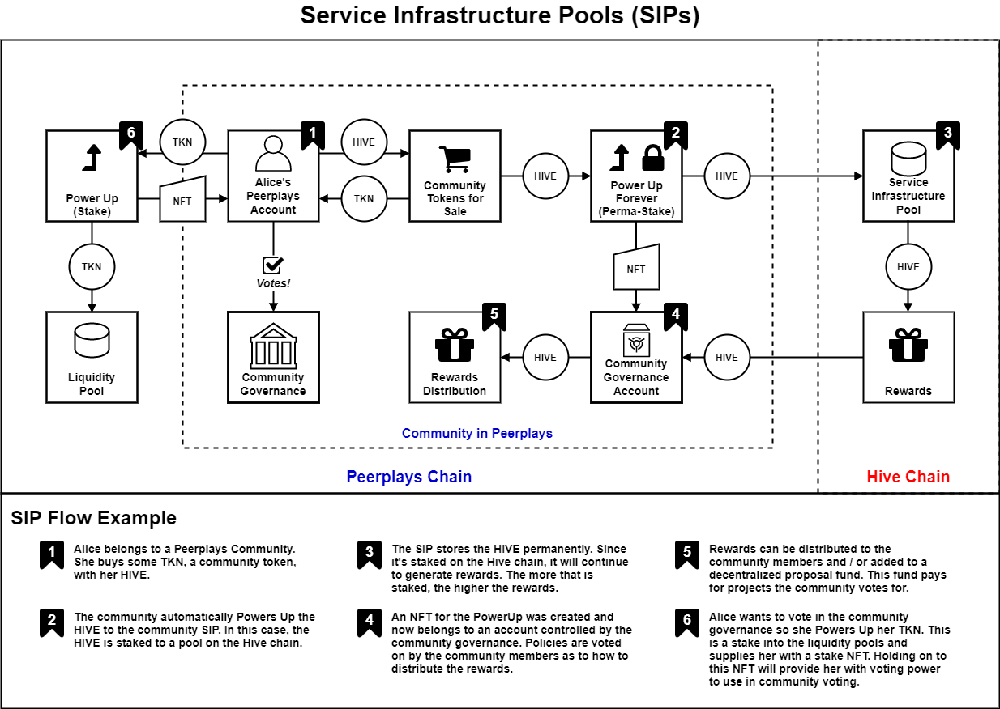

# Service Infrastructure Pools

Service Infrastructure Pools \(SIPs\) are a special type of asset pool with their own purpose. SIPs exist to support the sustained growth of Peerplays communities. Where normal liquidity pools \(LPs\) enable asset swapping on the Peerplays chain, SIPs in contrast provide funding and rewards to the community they belong to.

## 1.1. Comparison of LPs and SIPs

The following table shows the similarities and differences between liquidity pools and service infrastructure pools.

| Liquidity Pools | vs. | Service Infrastructure Pools |
| :---: | :---: | :---: |
| LPs provide the liquidity of assets so they can be instantly swapped. | **What's the purpose?** | Communities use SIPs as a steady stream of income for decentralized proposal funds and to reward community members. |
| Anyone can! LPs exist for any Peerplays asset. | **Who can stake to it?** | Communities can stake to SIPs automatically through the sale of their community tokens. |
| It's your choice. You can choose a locking period of up to 10 years. | **How long are assets staked? \(What's the locking period?\)** | Staking into a SIP is permanent. The staked assets will remain in the SIP forever. |
| You'll receive an NFT which represents your stake. This NFT will grant you voting power, and the right to claim rewards over time. | **What do I get for staking?** | Instead of staking directly to a SIP, the community will do so with the income it receives from selling a community token. So you receive some community token when you buy them directly from the community. |
| Your stake NFT is mature and you can Power Down the NFT to claim your stake back. | **What happens when the locking period is reached?** | There is no locking period for staking in SIPs. |

## 1.2. How does a SIP work?

When you buy a community token directly from the community the assets you used to purchase those tokens get automatically staked into that community's SIP. The community will receive a special stake NFT to a community governance controlled rewards fund account. This special NFT cannot be traded, sold, sent, transferred, or otherwise moved from the account. It also cannot be Powered Down and has no locking period. It is completely permanent on that account.

The NFT represents that community's stake in its SIP. This guarantees a steady income to the community through its \(now permanent\) stake in income generating DeFi rewards pools. Depending on the assets received for the sales of their community token, the SIPs can be stakes of Peerplays assets like PPY or even off-chain assets like HIVE. Since these stakes are permanent and are executed on the community level, the special NFTs do not generate voting power like normal stake NFTs do for staking in LPs.

Through community governance, the community decides what to do with the rewards received from its SIP. The community could decide to create a decentralized proposal fund to make continual improvements. Or the community could decide to simply pass the rewards on to its members. The community could even decide to do both and set the rate of each. Communities in Peerplays are empowered to self-govern.

## 1.3. SIP flow diagram

The diagram below shows the essence of Service Infrastructure Pools.

### Downloads

The Diagram in PDF form to easily view and share:



The Diagram in Draw.io's XML format. You can edit the diagram using this file in Draw.io:



