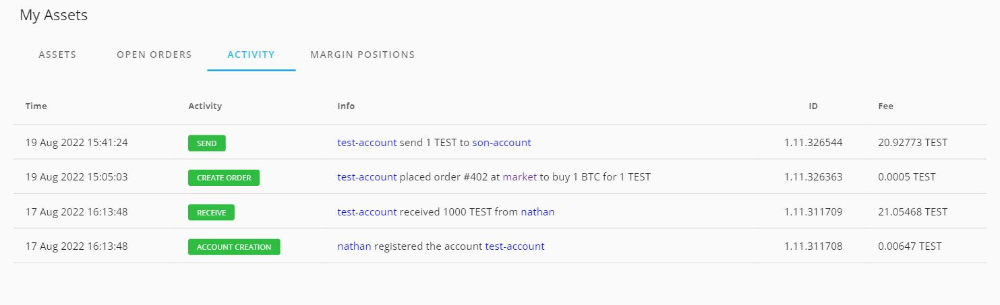
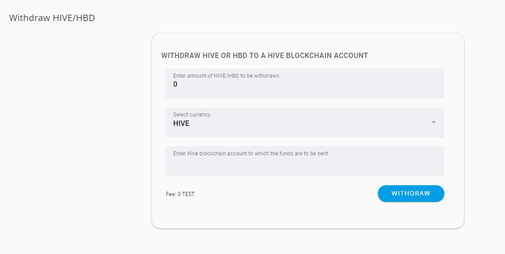

# User Guide

## Creating an account

1. Navigate to the [DEX](https://dex1.peerplays.download/) dashboard.
2. Click  `create an account`.

.JPG>)

3\. Enter a `Public Account Name` which can contain alphabet, number or dash .\
4\. Copy the existing `Password` and paste in the `Confirm Password` tab.\
5\. Click `create`.

.JPG>)

6\. After Clicking `Create` , Important Instruction about `Backup your keys` is listed. Click `Download & Take me to Dashboard` option to download the keys.

.JPG>)


If you forget the password, access to keys is the only option to recover the account. So, download and keep safe your keys and password.


7\. After downloading, it will direct to the `Dashboard` automatically.

.JPG>)

## Logging in

If not already logged in, click the `Log In` button in the navbar.&#x20;

Enter the account details and log in.


Lock Wallet - This helps in locking our wallet from any transaction based on the time set by the user. Use the drop down to select the desired time.



WhaleVault extension - This is the third-party browser extension to save private keys. By using this, the keys can be automatically pulled from the extension to unlock the profile.

To use WhaleVault, it has to be installed and the details about account should be input to use them.


## Navigation bar

### A. Menu

Clicking the menu button located at the top left of the navbar will reveal buttons to navigate to different sections of the DEX.

By default, these sections include [`Dashboard`](user-guide.md#dashboard), `Exchange`, `My Assets`, `Blockchain` , `Voting & Vesting`, `Settings`, `Bitcoin Transactions`, `Withdraw HIVE/HBD`.

### B. Search

Click the magnifying glass at the top right of the navbar to reveal search options.

Search can be done for `Users`, the two options are `Blocks` and `Tokens`. Partial search is implemented and data relevant to the characters typed will be displayed.&#x20;

### C. Notification

Click Bell icon in the Navbar to look for any notification.

### D. Unlock Profile 

Click on the **`lock`** icon near the account name which prompts to enter the Password/active key to unlock profile. This helps user while performing many transaction/action in the webpage as the profile is unlocked there is no requirement to enter credentials for all actions.​locked            ​unlocked

### E. Logout profile 

Click the accounts icon on the right side of Navbar which shows the "**`Account name`**" and click on the 3 dots which prompt to **`logout.`** This navigates the user out of account.​Logout option

## Detailed Description about the Menu 

## 1. Dashboard 

The dashboard consists of option to `sell/buy` and `send` option. Also it shows the details of your `Activity` and `Assets`.&#x20;

.JPG>)

### A. Quick Sell / Buy

This section enables users to quickly create market orders to buy assets.&#x20;

1. Enter the amount of paying asset in the first field - TEST.
2. Enter the amount of the desired asset in the second field. The second field consists of list options to chose like BTC, HBD, HIVE, PBTC, PEOS, PETH, TEST.
3. The fee for the filled out information will be shown.

4\. On Clicking the `buy` button, directs to enter the Password/active key to `Unlock` the profile and transaction will be completed.

.JPG>)

### B. Sending Assets

This section enables users to send assets to other users on the Peerplays blockchain.&#x20;

1. Enter a `quantity` of the asset to send.
2. Enter the account name of the desired recipient.
3. Select the desired asset.
4. Optionally, add a memo message to send.
5. Click `send`.

The fee will be listed once the quantity and asset are selected.&#x20;

6\. On Clicking `Send` button directs to enter Password/active key to unlock the profile and transaction will be completed.

.JPG>)

### C. My Activity

User activity can be viewed under this list. These activities include account creation, sending and receiving orders.

### D. My Assets

Assets owned can be viewed under this list. This includes the asset name, available Quote asset, price, change, volume, and actions.

## 2. Exchange

### A. Selecting an Asset Pair

To select an asset pair, click on the `asset/asset` button located at the top of the dashboard. and select the desired pair.

Click the tab to know about the Open Orders and Order History.

The `order book` is a quick way to fill out the buy and sell column with a defined amount of the asset pair selected.&#x20;

Select the desired pair to check the Order book and History of the pair.

### B. Buying and Selling an Asset

To buy or sell an asset, enter the price of the desired asset in terms of the paying asset and the quantity of the desired asset and click the `buy asset` or `sell asset` button. The total price before the fee will be displayed in the `total` field before the fee. The fees and current wallet balance will be shown before the order is placed.&#x20;

Click the `Buy BTC/ Sell BTC` to buy and sell the orders respectively will prompt to Order preview tab to complete the transaction.

This will create a listing under the `open orders` section of the exchange.&#x20;

### C. Cancelling Open Orders

To cancel an open order, move over the `Cancel` column on the desired open order to find the Trash Icon. Click on the icon to cancel that order.

.JPG>)

Clicking on Trash Icon prompt to enter Password/active key to complete the order.

## 3. My Assets 

### A. Assets

Assets owned can be viewed under this section. This includes the asset, available, quote asset, price, change, volume and actions.

### B. Open Orders

Open orders for the account can be viewed under this section. This includes the trade, order ID, description, price, market price and value.

### C. Activity

User activity can be viewed under this list. These activities include account creation, sending, and receiving orders.

### D. Margin positions

TBD

## 4. Blockchain

A blockchain is a digital database that stores information about every transaction. A single person does not control that database, making the blockchain a more secure way to perform transactions and store data than a traditional database system. This makes it an ideal tool for tracking the progress of products through the supply chain, from inception to delivery.

### A. Blockchain

This section explains about the details like Current block, Supply, Active witnesses, Confirmation time, Last irreversible block and stealth supply.

### B. Assets

Assets section contain the details of asset , issuer and the supply.

### C. Witnesses&#x20;

The witnesses section features the details about Active & Current witness, No of missed, remaining budget and the next time stamp for vote update.

### D. Committee&#x20;

This section features  about the Active & Pending details about name, votes and the URL of webpage.

### E. Fees

This section features about the Operation, Price per Kbyte, Standard fee and Member fee. The Operation includes transfer, limit order to create/cancel/upgrade/whitelist/update, account creation, fill order, asset, proposal, and witness.

## 5. Voting & Vesting

There are two options in vesting called "`Power UP`" and "`Power Down`". Vesting option is used to get the voting power. The power up option is to deposit GPOS balance for voting and incase if the user wants to withdraw GPOS balance then power down option can be used.

### A. Power Up

1. The opening GPOS balance will be displayed.
2. Increase the deposit as per your requirement and the new GPOS balance will be displayed.
3. &#x20;Click `VEST` and it prompts to enter the `password/active key`. After clicking  `unlock` option GPOS will be added to the account.&#x20;

### B. Power Down

1. The GPOS opening and available balance is displayed.
2. Increase/decrease the desired GPOS points and New GPOS balance, Fees will be displayed.
3. Click `WITHDRAW` option which prompts to enter the `password/active key` to `Unlock` the profile and withdraw the GPOS.

### C. Voting

The Voting performance, qualified reward, estimated rake reward and the time for next vote update will be displayed as section.

The voting section features the name, URL, vote count and option to vote for the desired accounts. The are two categories such as active and pending nodes which come under the witness, committee or son accounts.

The **`Active`** lists the accounts that are currently active in producing the blocks which are **`voted in`** and **`Pending`** nodes are waiting to be voted in to start their action.

### D. How to Vote?

To vote for any account hover over the `Votes` column of desired account name and it will show `Thumps up/Like` symbol (Highlighted below). Click on the symbol and it prompts to `save changes/cancel` option to vote. It also shows the commission that will be taken for voting.

.jpg>)

If any detail information is required about any account click on the account name under `Name` column. It will redirects to a separate page as show below.

This section provide detailed information about the Account and by clicking each tab required information can be viewed. If any transaction need to done then hover over the **`Actions`** column and click on the arrow (Highlighted below) which prompts to enter the **`password/active key`** to complete the process.

.JPG>)

Below image is the display of permission section for the asset and it can be altered based on the requirement.

## 6. Settings

The setting section has three tabs General, security, and membership. It helps the user to set language, notifications, time to lock wallet, membership details.

### A. General

This section helps to set up the language options such as English, Russian. Also to enable the notification about the account transfer and faucet URL where the registration fee for new user is payed.

### B. Security

This section is to set time to lock the wallet.

### C. Membership

This section provide an option to upgrade the subscription, the percentage of allocation and the fee statistics.

## 7. Bitcoin Transactions

This section provides the steps in Bitcoins address generation using the User existing information. The user should have the following details to generate the address,

1. Deposit Public key
2. Withdraw Public key
3. Withdraw address

After entering the correct details, click on **`Generate`** to generate the bitcoin address.


Only this bitcoin address is used to send BTC to Peerplays account. If the user request for BTC withdraw, then it will be send to the withdraw address provided during the bitcoin generation procedure.


## 8. Withdraw HIVE/HBD

This section helps to withdraw HIVE/HBD to a hive blockchain account.&#x20;

a. Enter the withdrawn amount of HIVE/HBD&#x20;

b. Select the currency either HIVE or HBD

c. Enter the blockchain account name where fund is to be transferred.

d. Click `WITHDRAW` which prompts to enter the password/active key to initiate the transaction.

