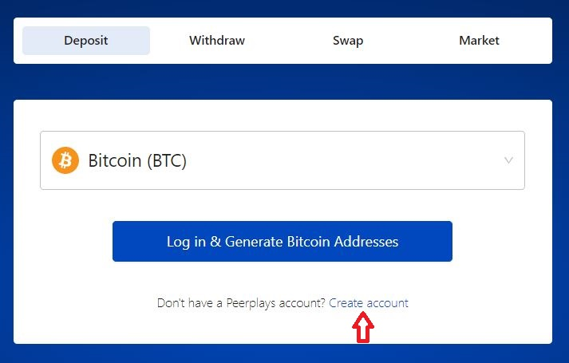

# Account Creation

## Creating an Account

1. Navigate to [NEX](https://nex.peerplays.com/) dashboard.
2. Click on **Create account** to create a new login.

<figure><figcaption>
Fig-1: Dashboard Page
</figcaption></figure>

3\. Enter the desired Username.&#x20;


User name should start with **lowercase.**

User name should not contain,

* Capital Letter
* Special Characters
* Only digits


<figure><figcaption>
Fig-2: Login creation
</figcaption></figure>

4\. For the first time, the password is auto-generated. Copy that password and paste it in the "**re-enter your auto-generated master password**" box.

5\. Click **"Download Recovery password file here"** option to download the Keys to use for future login.

6\.   Enable the checkboxes and click on **create account.**&#x20;

<figure><figcaption>
Fig-3: Create account page
</figcaption></figure>

7\. After successful login, the following screen will be displayed.

<figure><figcaption>
Fig-4: Login Creation Success
</figcaption></figure>
