# Dashboard

There are 4 tabs in the dashboard section,

1. Deposit
2. Withdraw
3. Swap
4. Market

## 1. Deposit

This section helps the user to deposit assets into the account. The current version supports two assets BTC and HIVE.

<figure>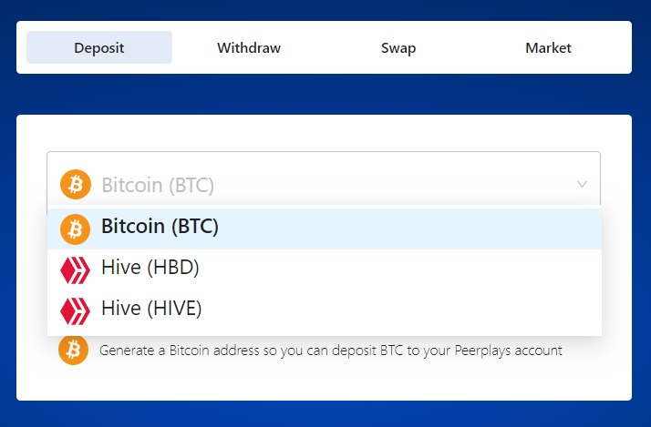<figcaption>
Fig-1: Deposit section
</figcaption></figure>

### BTC Deposit

To deposit bitcoin, select BTC from the drop-down list and click on **Generate Bitcoin address**. This prompts to enter the password to confirm the validation.&#x20;

<figure>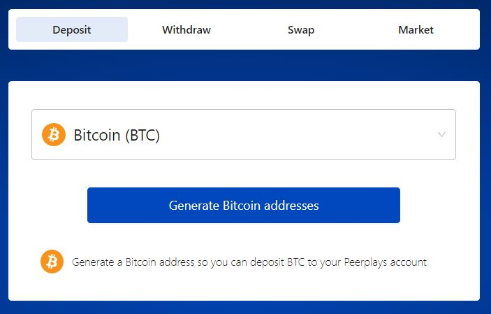<figcaption>
Fig-2: Bitcoin Deposit
</figcaption></figure>

<figure>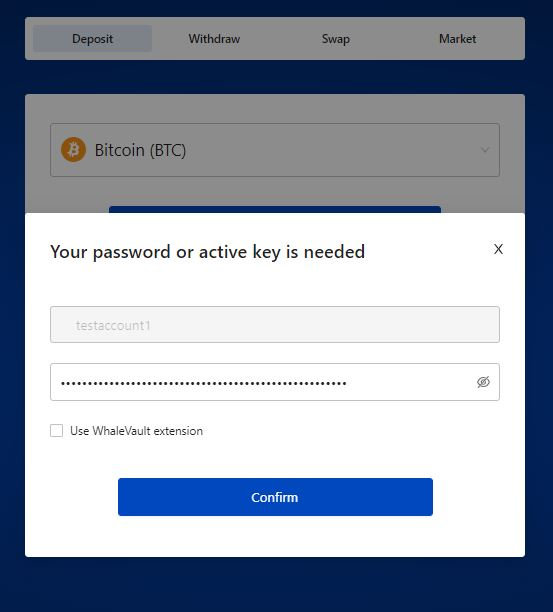<figcaption>
Fig-3: Account Validation
</figcaption></figure>

Next, the sidechain address has to be added to generate the deposit address. Click on confirm to add the sidechain address.

<figure>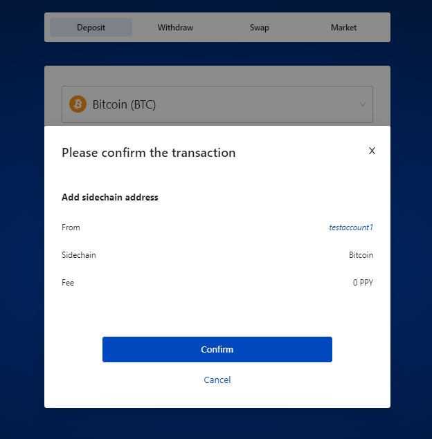<figcaption>
Fig-4: Sidechain address confirmation
</figcaption></figure>

Download the private keys for future use to deposit/withdraw BTC.&#x20;

<figure>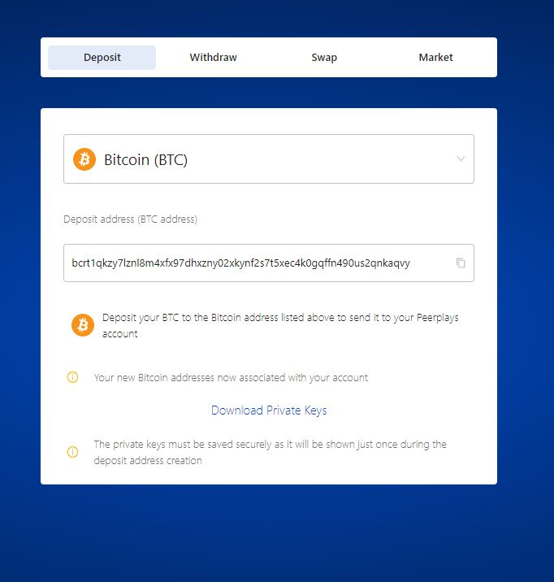<figcaption>
Fig-5: Download private keys
</figcaption></figure>

Please follow the steps in the below link for any Bitcoin transaction,



## HIVE Deposit

To deposit HIVE/HBD, select HIVE from the drop-down menu. It instructs to send funds to son-account on hive blockchain with memo as account name.

<figure>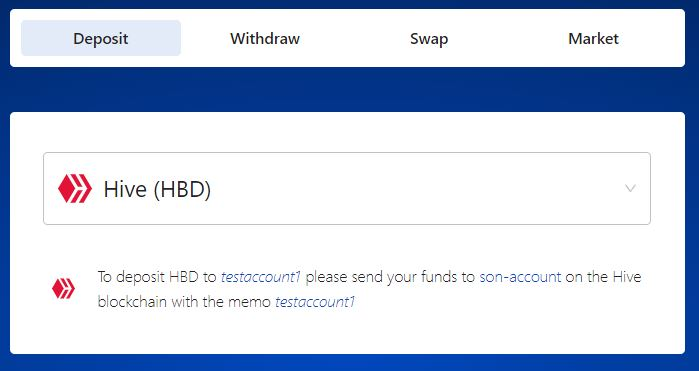<figcaption>
Fig-6: Hive Deposit
</figcaption></figure>

## 2. Withdraw

To withdraw the desired asset choose withdraw tab in the dashboard. There are two assets supported in this version BTC and HIVE.

## BTC Withdraw

1. Select BTC from the list of options in the drop-down list.
2. Enter the required amount of BTC to be withdrawn.
3. Enter the Compressed withdraw public key & address from the keys text file.
4. The Estimated fee, total transaction and time will be calculated based on the withdraw amount.
5. Click on **Withdraw** button to initiate the transaction.

<figure>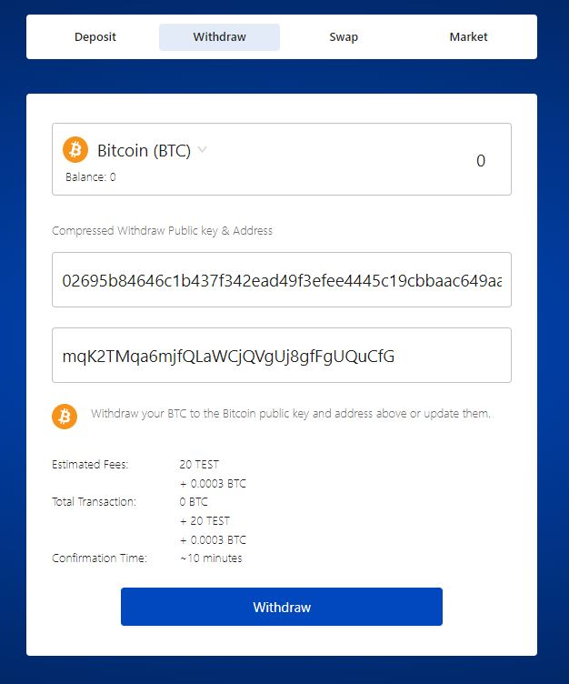<figcaption>
Fig-7: BTC withdraw
</figcaption></figure>

## HIVE Withdraw

1. Select **HIVE** from the list of option available in the drop-down list
2. Enter the amount to be withdrawn from the account
3. Enter the HIVE account withdraw address in the text box
4. The Fees, total transaction and time will be calculated based on the withdraw amount.
5. Click on **Withdraw** to initiate the transaction.

<figure>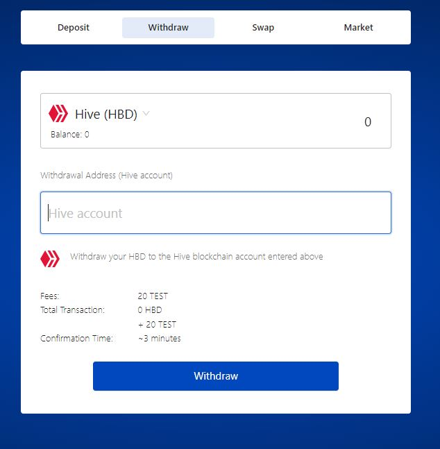<figcaption>
Fig-8: Hive Withdraw
</figcaption></figure>

## 3. Swap

The swap functionality is the quick way to exchange the asset. The assets that can be exchanged with each other  are Bitcoin(BTC), Hive (HBD), Hive (HIVE), Peerplays (PBTC), EOSIO (PEOS), Ethereum (PETH).

<figure>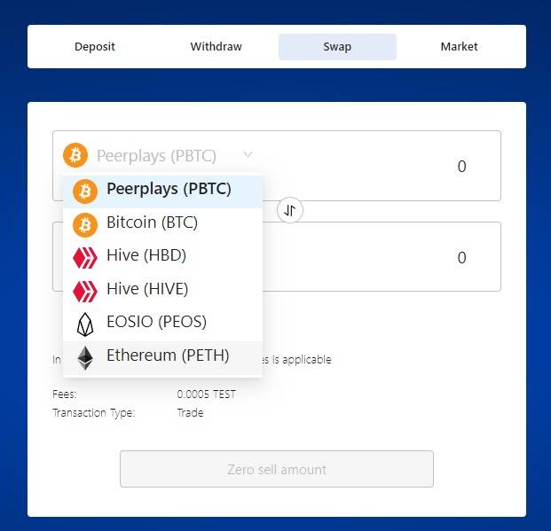<figcaption>
Fig-9: Assets  
</figcaption></figure>

1. Select the asset from which the amount has to be swapped and enter the amount to be transferred.
2. Select the asset to which the amount has to be received. The amount will be calculated based on the transfer amount.
3. The fees and type of transaction will be displayed.

<figure>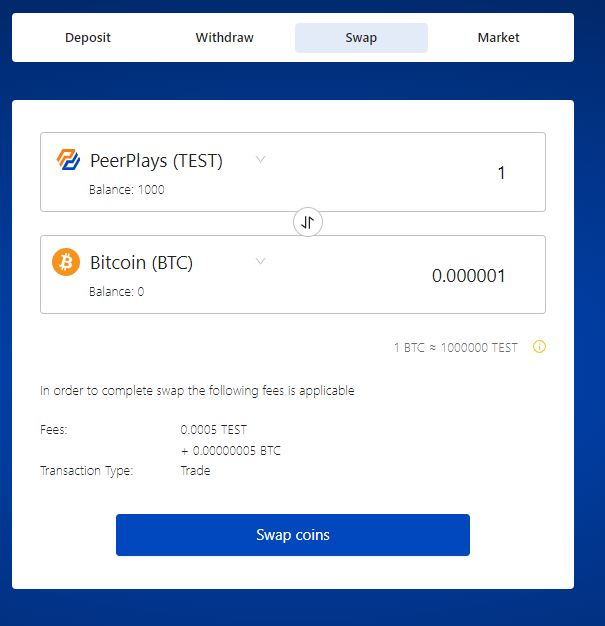<figcaption>
Fig-10: Coin swap
</figcaption></figure>

4\. Click on **Swap Coins** button to initiate the swap which prompts to enter the password for validation.

5\. The swap order will be displayed. Click on Confirm button to complete the swap.

<figure>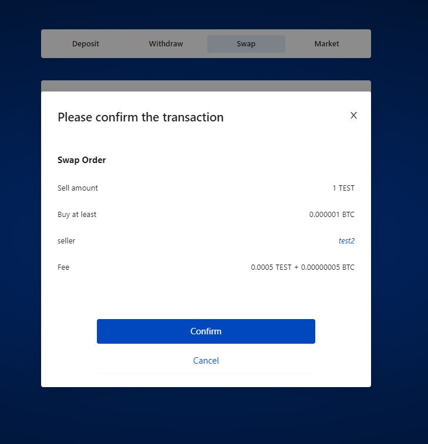<figcaption>
Fig-11: Swap order transaction
</figcaption></figure>

6\. After successful swapping, the success message will be displayed.

<figure>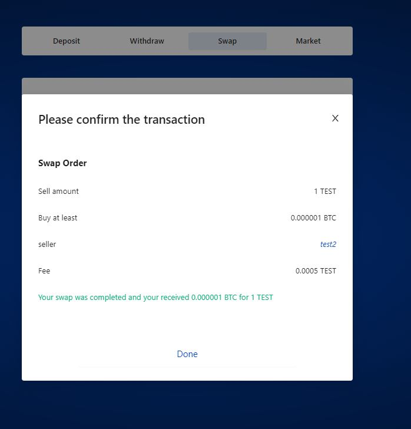<figcaption>
Fig-12: Transaction confirmation
</figcaption></figure>

&#x20;7\. Click Done to reflect the changes in the dashboard.

## 4. Market

The Market tab is the short-cut way to choose the Trading pair for any transaction. The trading pairs will be listed in blocks, hoover over the blocks to click any option.

<figure>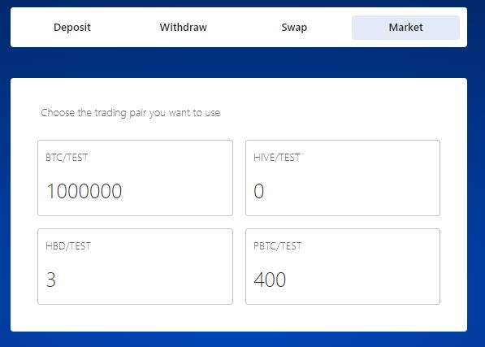<figcaption>
Fig-13: Market page
</figcaption></figure>

On clicking the desired block, it will direct to the Market tab to display all the activities of the Trading pair in detail.&#x20;

<figure><figcaption>
Fig-14: Market-page Trading pair
</figcaption></figure>

The Market page can also be chosen from the list of menu available.

<figure>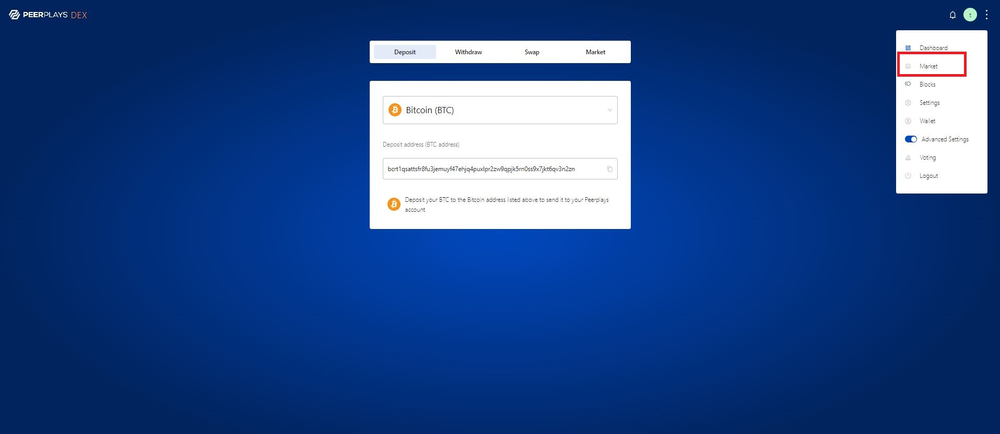<figcaption>
Fig-15: Menu selection-Market page
</figcaption></figure>

