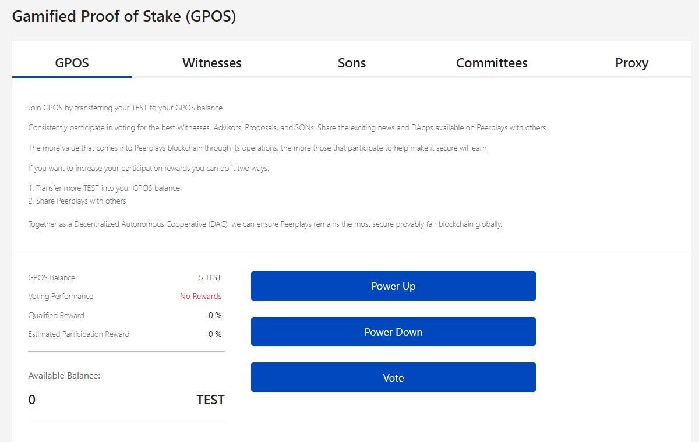
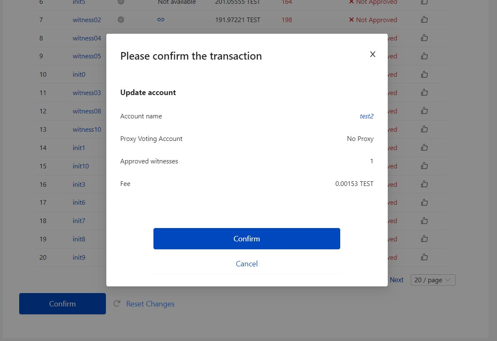
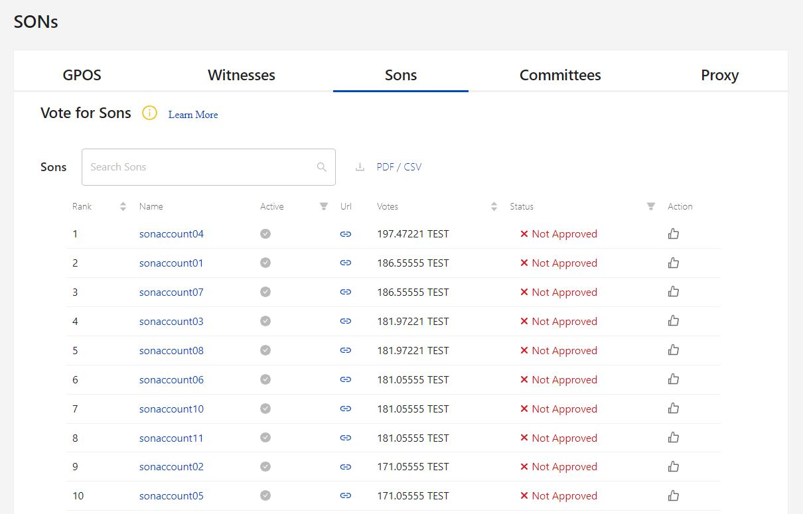
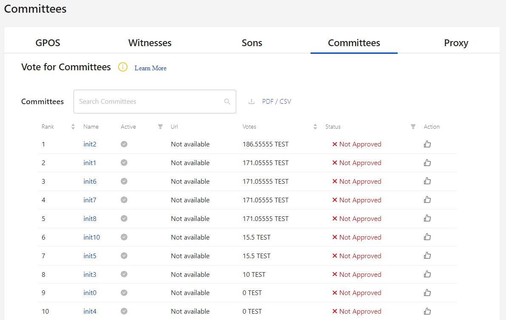
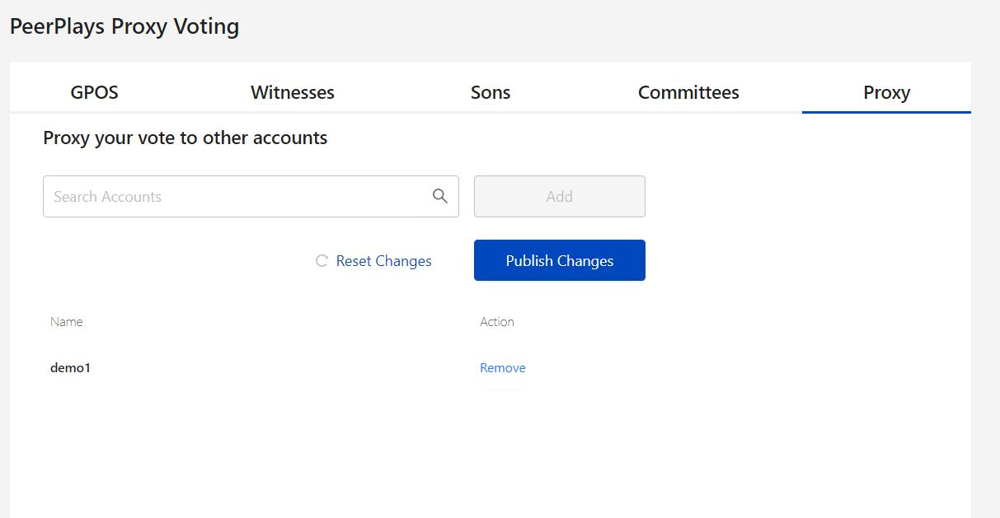
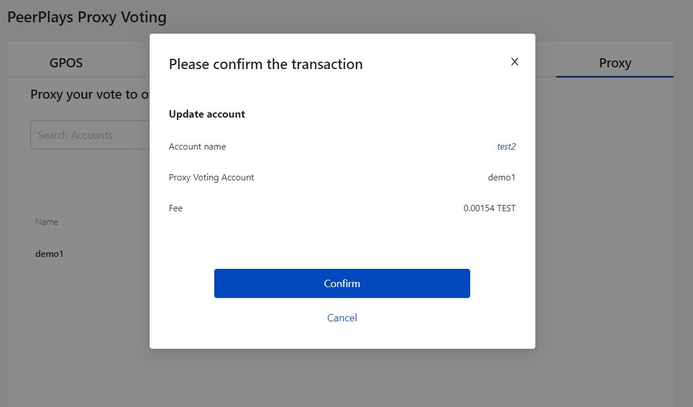
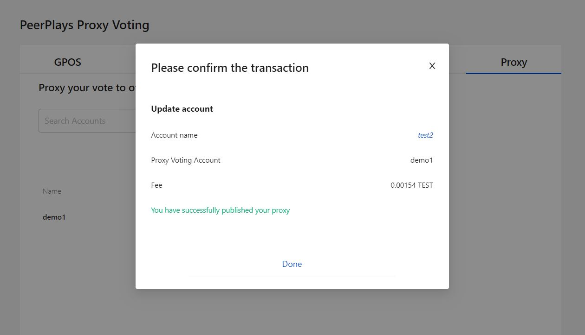

# GPOS - Voting

## 1. GPOS

The GPOS page offers the user to perform the operations like power up, power down and voting. The Gamified Proof of Stake (GPOS) is for blockchain governance by voting for the various nodes in the network. User need a simple and intuitive way to compare the candidates they can vote on. The page consists of 5 different tabs,  &#x20;

<figure><figcaption>
Fig-1: GPOS Page
</figcaption></figure>

## A. Power Up

Click on the **Power Up** button in the GPOS tab. This mainly allows the user to participate in voting. The notice to explain about the user participation is listed in this page.

### How to Vest?

* The opening and available balance is shown in the text boxes.
* Click on '+' to increase the deposit value
* The new balance will be updated based on the deposit.

<figure><figcaption>
Fig-2: Power up page
</figcaption></figure>

* Click on **Vest** to begin the transaction and it prompts to enter the password for validation.
* Next, Click on confirm to complete the transaction.

<figure><figcaption>
Fig-3: Active Key 
</figcaption></figure>

<figure><figcaption>
Fig-4: Transaction confirmation
</figcaption></figure>

* Click on Done, after successful transaction. The amount will be vested into the desired account.

<figure><figcaption>
Fig-5: Successful Confirmation
</figcaption></figure>

## B. Power Down

When the user has a need to withdraw the asset from power up, then Power down will be the option.&#x20;

Click on Power down option from the GPOS tab, that switch to power down tab in the next page

The notice about the withdraw of balance and it's impact will be listed.

Next, the opening balance, available balance will be listed in text boxes.

The user has to increase the withdraw value to withdraw any desired amount.

The new balance will be updated based on withdraw value.

Click on withdraw button to initiate the transaction. It prompts to enter the password to validate the account.

Next, Click on confirm to complete the transaction.

<figure><figcaption>
Fig-6: Power down
</figcaption></figure>

## C. Vote

Clicking on Vote will direct to the main page of GPOS. The tabs such as Witnesses, Sons, and committees has the list of name which has the option to Vote.

The **Action** section in the last column helps the user to vote desired account.

User has to click on the Thumps up icon symbol under the Action column of the desired account.

The icon will be grayed out to denote that voting has been done.

At the bottom of the page, Confirm button will be enabled and click on the button.

It prompts to enter the password to validate the account.

Next, click on confirm to complete the voting process.

<figure><figcaption>
Fig-7: Voting
</figcaption></figure>

<figure><figcaption>
Fig-8: Voting Confirmation
</figcaption></figure>

## 2. Witnesses

<figure><figcaption>
Fig-9: Witnesses list
</figcaption></figure>

## 3. Sons

<figure><figcaption>
Fig-10: Sons account list
</figcaption></figure>

## 4. Committees

<figure><figcaption>
Fig-11: List of committee members
</figcaption></figure>

## 5. Proxy

The proxy option helps to add other account with the existing account to perform the function of that account in this existing one.

Enter a valid account name in the search box which enable Add button.

Click on ADD to add the account.

Click on Publish Changes button to apply the changes and to add the account.

<figure><figcaption>
Fig-12: Proxy account addition
</figcaption></figure>

<figure><figcaption>
Fig-13: Confirmation
</figcaption></figure>

<figure><figcaption>
Fig-14: Proxy publishing Successful
</figcaption></figure>
