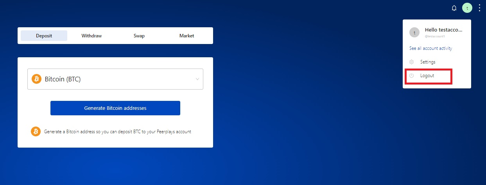
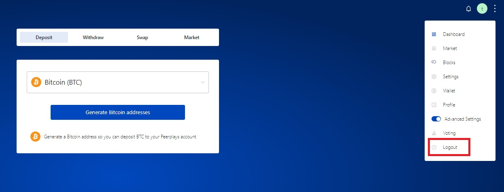

# Logout

To logout of the account, the user has two option.

1. The user can click on the account name in the header tab and choose logout option.

<figure><figcaption>
Fig-1: Logout option1
</figcaption></figure>

&#x20;2\. The user can click the menu option and logout will be at the bottom of the list.&#x20;

<figure><figcaption>
Fig-2: Logout option2
</figcaption></figure>
