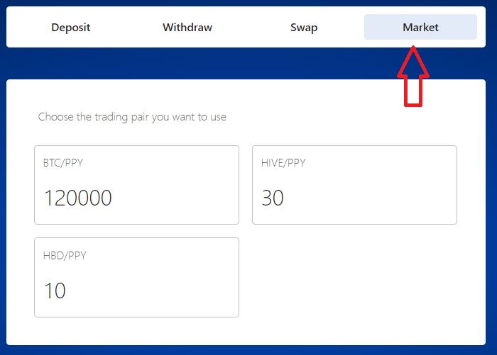

# Market Activity

The market activity page helps in analysing the statistics of any trading pair. The statistics include the value of current price, change (in percentage), volume for any trading pair.

The trading pair will be between the following assets,

* BTC
* HBD
* HIVE
* PPY

The market page navigation can be done in two ways,

1. **From the Dashboard**

Click on the **Market Tab** in the Dashboard page and select any Trading pair to navigate to the Market page.

<figure><figcaption>
Fig-1: Dashboard selection
</figcaption></figure>

2\. **From the Menu option**

In the home page, click on the three dots present in the right pane. All the option available will be listed and select Market from the available option to navigate to the Market tab.

<figure><figcaption>
Fig-2: Menu option-Market page
</figcaption></figure>

### 1. Market page Overview

The market page consists of the following section,

* Trading pair selection
* Buy/Sell asset
* My Open orders
* My Open History

<figure><figcaption>
Fig-3: Market page 
</figcaption></figure>

### 1. Trading pair selection

To select any trading pair, click on the drop-down button available on the left pane of market page. The drop-down option open a tab to select the desired asset for trading.

<figure><figcaption>
Fig-4: Trading pair selection
</figcaption></figure>

The select pair tab will allow the user to choose any assets like BTC, HBD, HIVE, and PPY. The pairing can be done among these assets.&#x20;

In the recent pair option, the existing selection will be displayed. The user can choose the trading pair from this button too.

Finally, click on confirm to choose the trading pair or choose cancel to go back to the market page.

<figure><figcaption>
Fig-5: Select pair
</figcaption></figure>

For any trading pair, the details about the pair will be listed like current price, change and volume. There are two option to analyse the selected trading pair namely,

* Order Book
* History

#### Order Book

This option provides details about the total, sell and buy orders based on user selection from the option available.

It also has the drop-down list to choose the threshold value.

<figure><figcaption>
Fig-6: Asset summary
</figcaption></figure>

#### History

The history option helps the user to analyse the previous activities under the selected trading pair. It show the details about the buy and selling details of asset with price and time.

Red color represents the sell orders while green color is for buy orders.

<figure><figcaption>
Fig-7: Asset history
</figcaption></figure>

### 2. Buy/Sell Asset

This section in Market page helps to Buy/sell the asset of the selected Trading pair. The assets will change according to the pair selection. In this example, the selected trading pair is BTC/PPY.

Input the value for Price and quantity of asset to calculate the Total value. Based on the input, the fees, market fees and balance will be updated. Click on the Buy/Sell button to place the order.

<figure><figcaption>
Fig-8: Buy/Sell Asset
</figcaption></figure>

### 3. My Open Orders

The open orders tab display the details of the current order for the selected trading pair. The details include price, asset value (in this case, BTC and PPY), expiration and action.

<figure><figcaption>
Fig-9: Open orders
</figcaption></figure>

### 4. My Order History

In this section, the order history of the selected trading pair will be displayed. The values such as asset (In this example BTC and PPY), price and date of purchase are listed.

<figure><figcaption>
Fig-10: Order history
</figcaption></figure>
