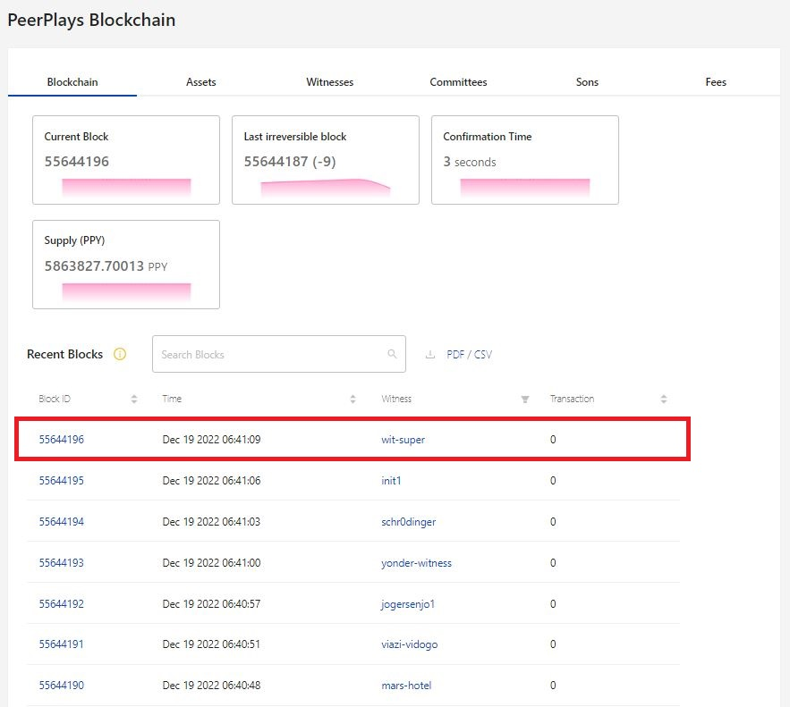
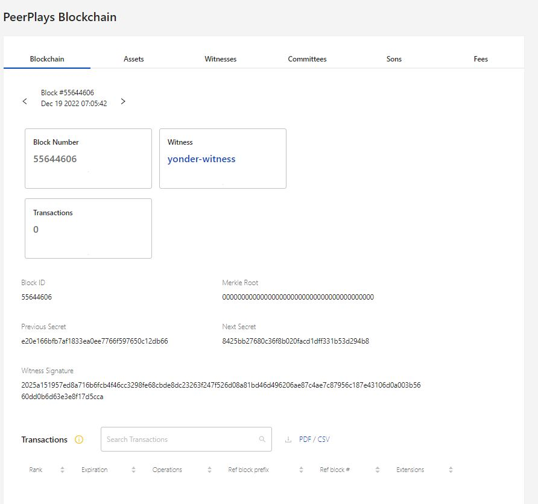
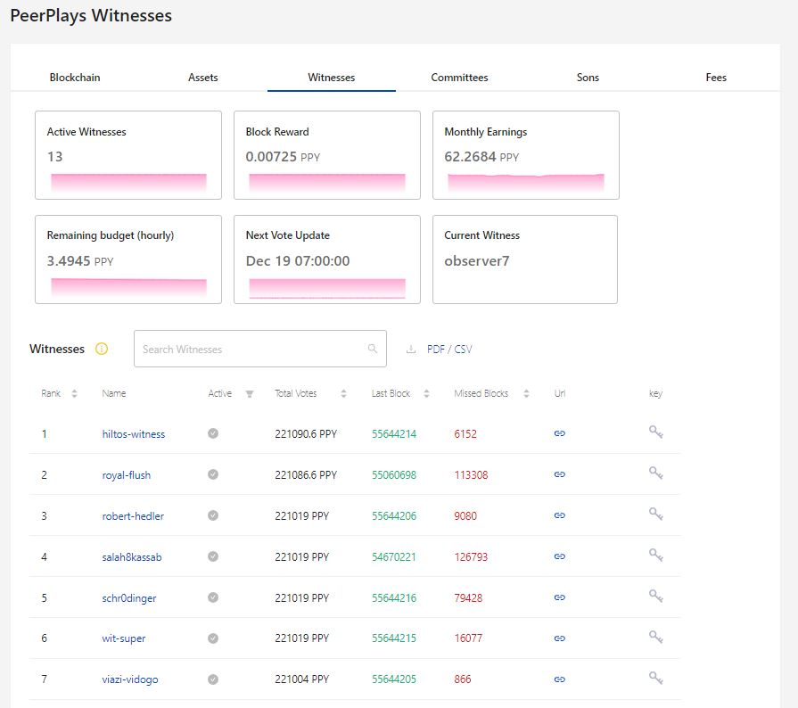
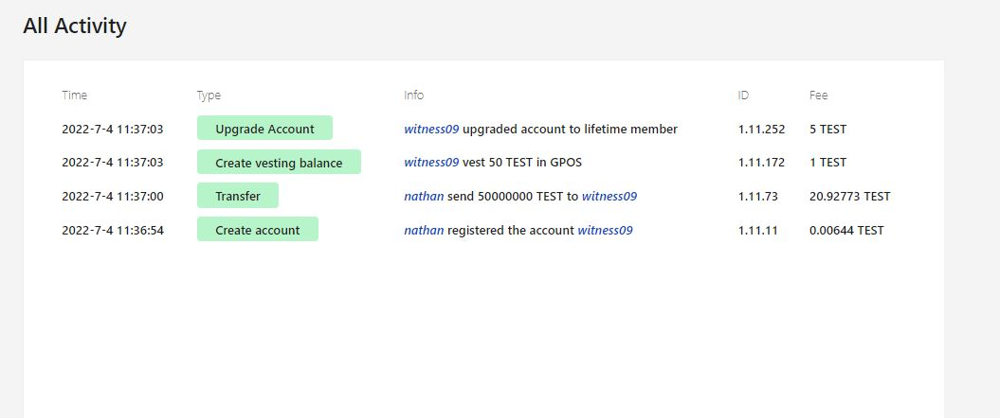
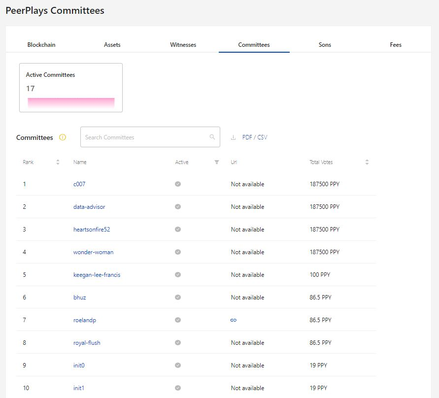
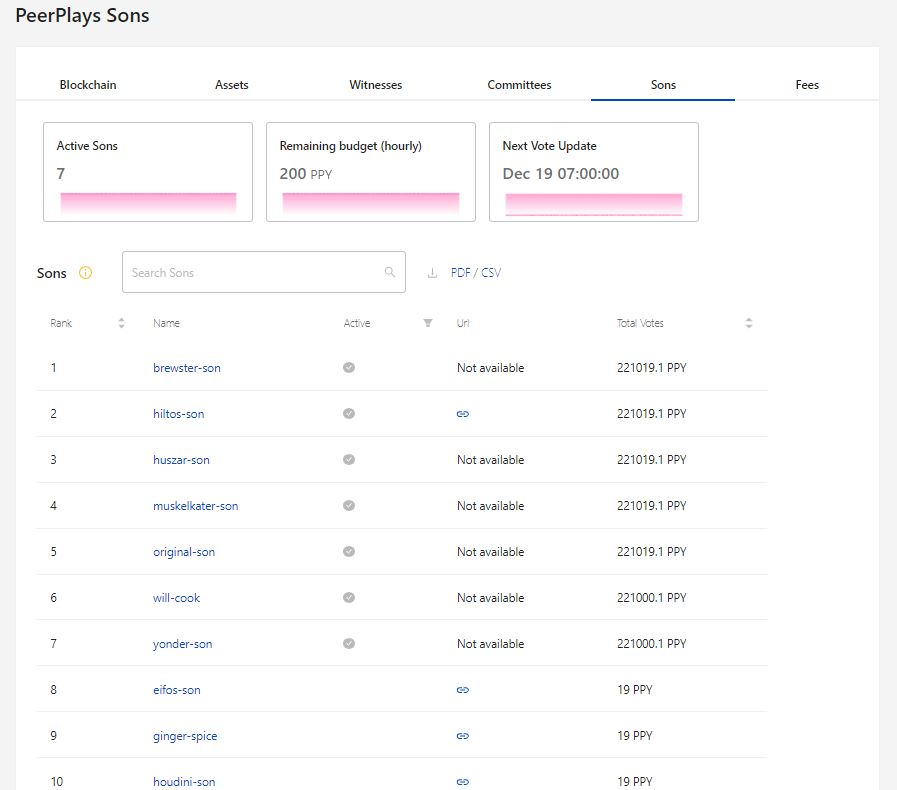
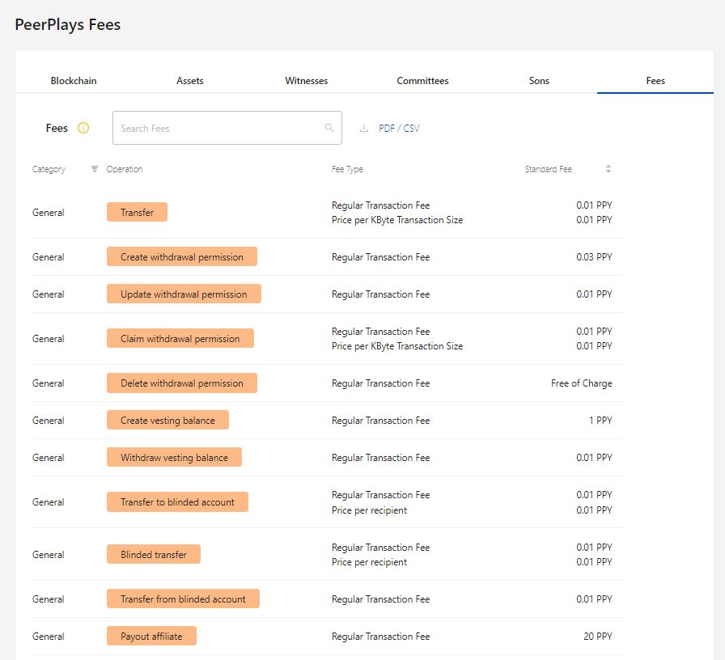

# Peerplays Blocks

The  Peerplays blockchain section helps the user to  understand the transactions happening in the blocks. This page has the details of blockchain, asset, witnesses, committees, sons, and fees associated with that account.

To navigate to this page, click on the Blocks from the list of option available in the Menu on right pane.

<figure><figcaption>
Fig-1: Block option in Menu
</figcaption></figure>

## Blocks Page - Overview

The block page consists of details about the blocks associated with the account. The tabs under this page are Blockchain, Assets, Witnesses, Committees, Sons, Fees.

<figure><figcaption>
Fig-2: Blockchain details
</figcaption></figure>

## 1. Blockchain

This tab contains information about the block based on the recent activity. The information consists of current block, last irreversible block, confirmation time, supply.

The most recent block activity will be featured on the top of page and it will be updated based on each block activity.

<figure><figcaption>
Fig-3: List of blocks
</figcaption></figure>

Click on a particular Block ID to learn about the block in detail.

<figure><figcaption>
Fig-4: Block in detail
</figcaption></figure>

## 2. Asset

The number of assets associated with the account will be listed in numbers. Search bar is provide to search any asset along with option to download the details in PDF/CSV file format for future references.

The filter option available to sort the assets are ID, Max supply, Precision in ascending/descending order. Also the assets can be sorted based on certain category using Symbol, name and issuer option.

<figure><figcaption>
Fig-5: Asset selection
</figcaption></figure>

## 3. Witnesses

The witnesses associated with the account will be listed in blocks. The number of active and current witness along with earning will be listed.

The search bar helps in finding the witness at ease. There is option to download the list in PDF/CSV format for future references.

The filter function helps to sort the data based on Rank, Total votes, Last block, Missed blocks counts.

Click on the name to learn about the witness activity in detail.

<figure><figcaption>
Fig-6: List of Witness
</figcaption></figure>

<figure><figcaption>
Fig-7: Asset in detail
</figcaption></figure>

## 4. Committees

The number of active committees for the account will be displayed in blocks. The search bar helps in finding the member at ease. There is option to download the list in PDF/CSV format for future references.&#x20;

The filters will be based on Rank, total votes and can be sorted in ascending/descending order. Click on the name to learn the activity of each committees in detail.

<figure><figcaption>
Fig-8: List t of active Committee 
</figcaption></figure>

## 5. SONs

The number of active Sons will be displayed in blocks along with budget and next vote update time.

The search bar helps in finding the account at ease. There is an option to download the list in PDF/CSV format for future references.

Based on Rank and total votes the list can be filtered. Click on the particular name to learn their activity in detail.

<figure><figcaption>
Fig-9: List of Sons
</figcaption></figure>

## 6. Fees

The standard fees associated with each transaction will be listed along with their operation type like transfer, update, withdraw, etc.,

<figure><figcaption>
Fig-10: Fees details
</figcaption></figure>
