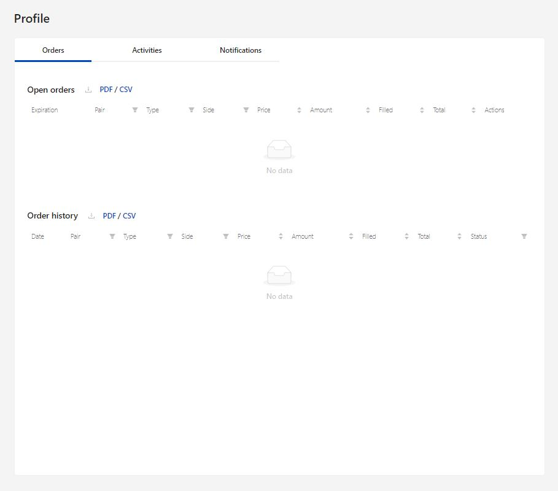
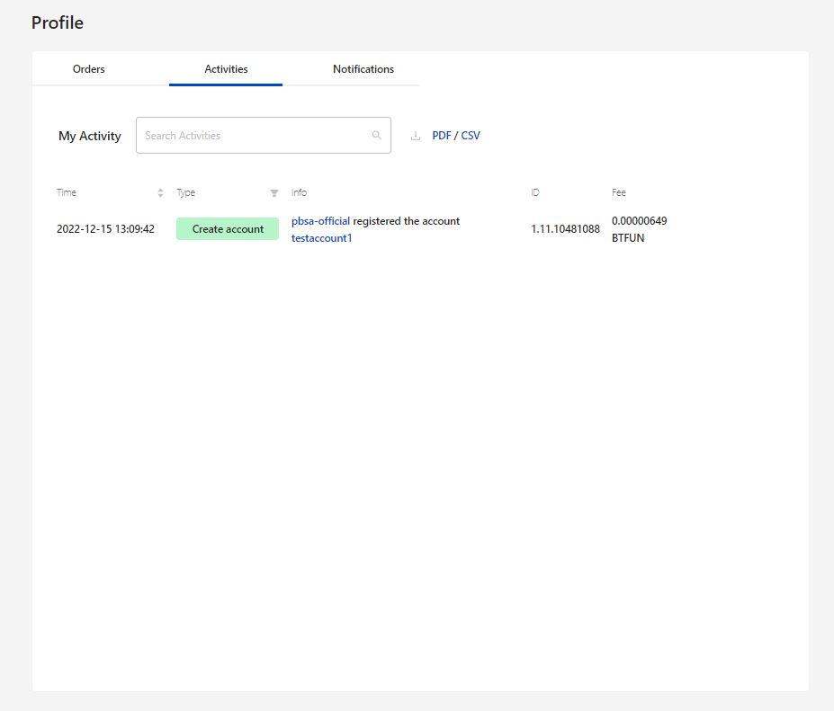
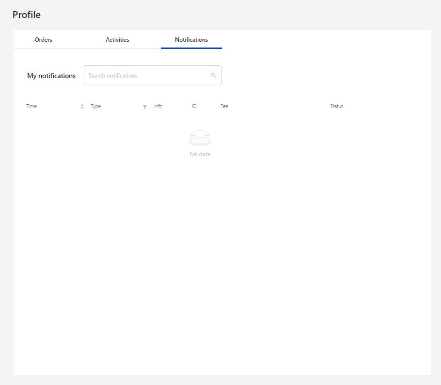

# Profile

## 1. Orders

The order tab displays the collection of all details about the Open order and Order history happened from the beginning of account creation.

It also provide the option to download the PDF/CSV file in a single click.

<figure><figcaption>
Fig-1: Order details
</figcaption></figure>

## 2. Activities

This tab provide the list of activities happening in the account. Based on the time of activity, there is filter option to sort in either ascending/descending order.&#x20;

With the Type filter, based on activities like create account, fill order, cancel order, etc., it can be sorted.

Each activities has its own information about the activity, ID and Fee involved in it.

<figure><figcaption>
Fig-2: Account Activities
</figcaption></figure>

## 3. Notification

This tab provides the list of notifications occurred in the account. Based on the time of notification, there is filter option to sort in either ascending/descending order.&#x20;

With the Type filter, based on notification like create account, fill order, cancel order, etc., it can be sorted.

Each notification has its own information about the activity, ID and Fee involved in it.

<figure><figcaption>
Fig-3: Account notifications
</figcaption></figure>

