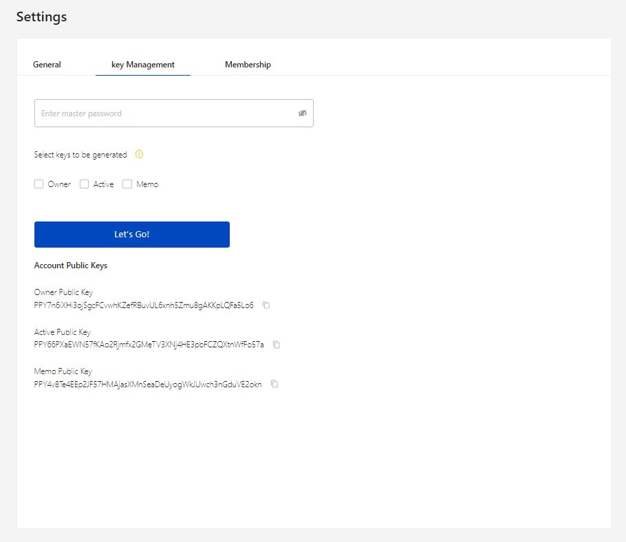

# Settings

The settings page helps the user to manage the activities of the accounts like language selection, lock account, notification settings, key management, and membership.

There are three section in the settings page,

1. General
2. Key Management
3. Membership

## 1. General

The general section consists of option to select language, enable notification and set lock wallet time.

* **Select language** option has a drop-down menu to choose language among English and Russia.
* **Show notification** option has Yes/No selection to enable/disable notification based on user's choice.\
  By selecting **Yes,** the check boxes to enable notification for each activities will be visible.\
  By selecting **No,** the check boxes will be grayed out.
* **Lock wallet** option has the drop-down list with time in minutes. This helps the user to choose a desired time to lock the account.
* The URL to copy the faucet link will be provide at the bottom of the page.

<figure><figcaption>
Fig-1: General settings
</figcaption></figure>

## &#x20;2. Key Management

This tab helps the user to generate keys for owner, active and memo account. The public account key will be listed at the bottom of the page.

a. The user has to enter the Master password in the tab provided.&#x20;

b. Select the keys that has to be generated by clicking the required name such as Owner, Active and Memo

c. Click the button _**Let's go**_ to generate the keys.

<figure><figcaption>
Fig-2: Key management settings
</figcaption></figure>

<figure><figcaption>
Fig-3: Key generation
</figcaption></figure>

## 3. Membership

This tab provide the details about the existing information about the account. The details include Fee allocation, Fee statistics, Pending Fees, Vesting Fees.

This page allow the user to Buy Lifetime Subscription in a single click.

* [ ] Click on the **Buy Lifetime Subscription** button, next it shows a screen to enter password to confirm the login.
* [ ] After successful login, confirm the transaction to upgrade your account.

<figure><figcaption>
Fig-4: Membership details
</figcaption></figure>

<figure><figcaption>
Fig-5: Lifetime membership confirmation
</figcaption></figure>

