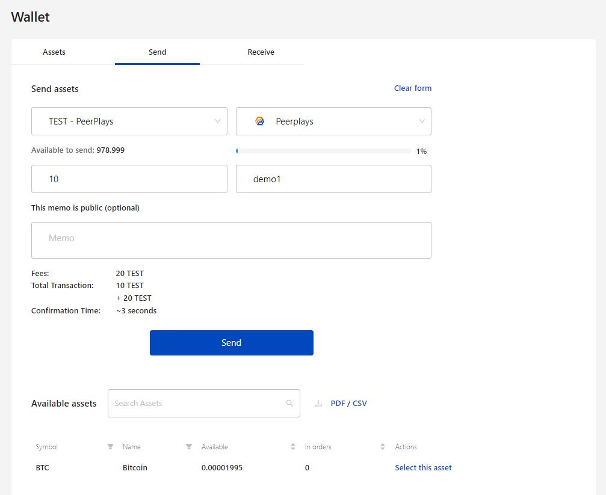
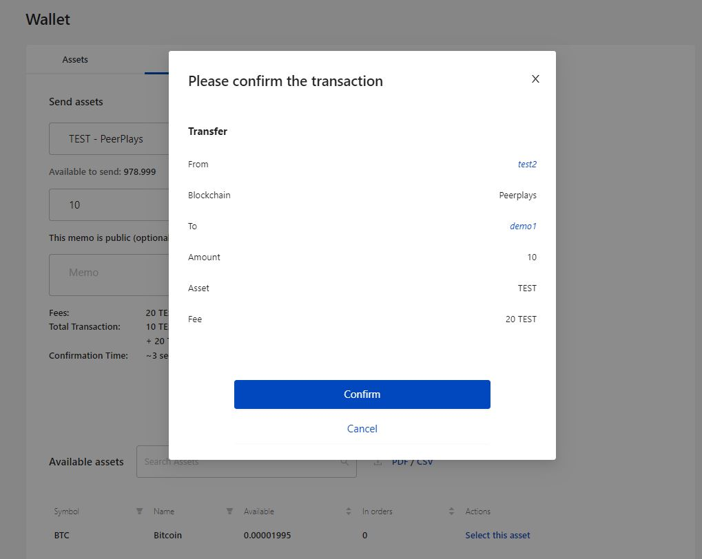
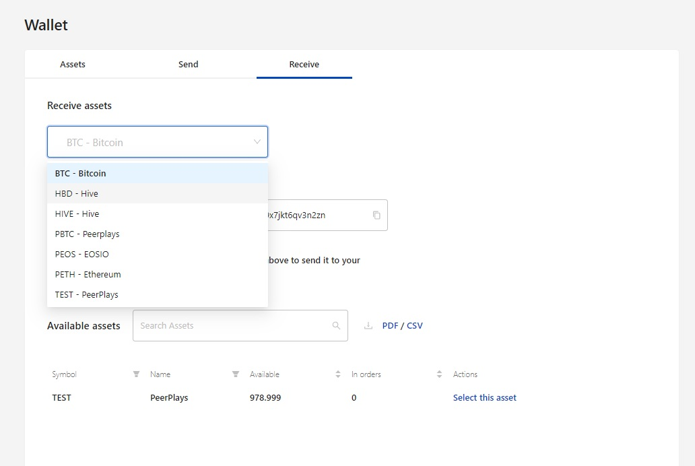
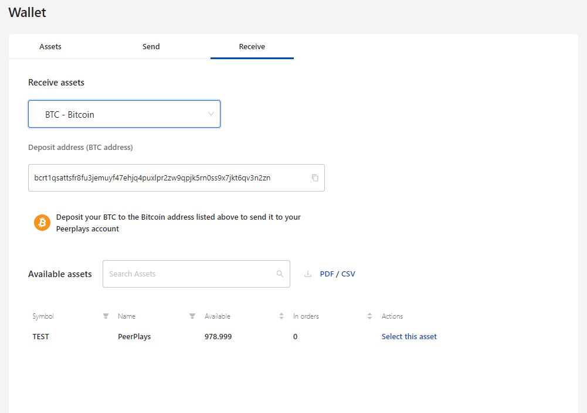

# Wallet

The wallet option allows the user to view the asset available in that account. It also has the option to send and receive assets from other accounts.

The Wallet has three sections,

1. Asset
2. Send
3. Receive

## 1. Asset

This section displays the list of asset available in the account. Search option is available to find any desired asset. The list of asset can be downloaded in the form of PDF/CSV file.

The list of asset can be filtered based on symbol, name, available tokens, orders.

Each asset has two button namely, send/receive to perform the transaction in single click.&#x20;

<figure><figcaption>
Fig-1: Asset details
</figcaption></figure>

## 2. Send

The send section has the option to send available asset from wallet to another account.&#x20;

1. Fill in the form with correct input based on your transaction.

<figure><figcaption>
Fig-2: Sending asset to account
</figcaption></figure>

2\. Click on **Send** button to initiate the transfer. Next, it prompts to enter the password for validation.

3\. Click on **Confirm** to complete the transaction. The asset will be successfully transferred to another account.

<figure><figcaption>
Fig-3: Transaction confirmation
</figcaption></figure>

## 3. Receive

To receive asset from another account to your account, the wallet receive option can be used. Select the desired option under the Receive assets drop-down list.

Based on the asset selection the hint to perform the transfer will be provided. Follow that to complete the transaction.

### List of assets

<figure><figcaption>
Fig-4: List of asset to receive
</figcaption></figure>

### &#x20;After asset selection

<figure><figcaption>
Fig-5: Asset selection to receive
</figcaption></figure>
