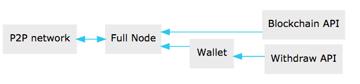

# Peerplays Technical Summary

## Introducing Peerplays

Peerplays is a decentralized, provably fair global gaming platform, built on the most advanced blockchain technology available today. Peerplays brings a new paradigm of fairness, speed, transparency, and security to the global gaming industry.

Peerplays’ decentralization is based on the Delegated Proof of Stake \(DPoS\) consensus model, meaning that blocks are produced by a group of ‘Witness’ nodes which are elected by stake-weighted token holder voting. 

In addition to the Witnesses are the Advisors, a group of blockchain accounts, likewise elected by token holder voting, which vote to specify configurable blockchain parameters, and vote to include or reject proposed new features and other modifications to the consensus protocol.

Peerplays is a smart contracting platform specifically targeted at gaming contracts. 


Note: Peerplays is not a _Turing complete_ smart contracting platform, meaning that Peerplays does not support arbitrary, user-defined smart contracts; rather, it provides a well-defined set of officially maintained, built-in contracts. This is in contrast to _Turing complete_ smart contracting platforms like EOS or Ethereum, which provide few to no official contracts, but allow users to define and share contracts without any formally defined quality or correctness verification.


This document is intended to give new Peerplays developers an introduction to the Peerplays architecture and software. Readers are expected to be familiar with C++ software development in general, but not with Peerplays specifically. 

This document will walk readers through the code repository structure and how to build the software; describe the individual libraries and executables and their purposes; and examine how the contracts work and discuss how to create or modify Peerplays smart contracts.

## Graphene

Graphene is the underlying technology behind the Peerplays blockchain.vIt's an open-source blockchain technology, mainly written in C++. The Graphene source is available in numerous variations, as it has been forked and adapted many times.

There is no other known blockchain like Graphene that can even try to compete in the processing such a high number of transactions this blockchain already can. 

Graphene-based coins can do something Bitcoin was never capable of, and will never be. And that is being a real-time value exchange system that will get mass adoption, with great apps built upon it. 

A few of the advantages of Graphene are:

* Can push over 10,000 transactions per second \(TPS\), versus Bitcoin, currently at around 7 transactions per second - this could mean Bitcoin payments hanging for 3-4 days!
* Best in class block productional and transaction finality at three seconds compared to Bitcoin at 10 minutes.
* Supports payments with zero commission. Users can transfer coins from one account to another absolutely free of charge.
* Uses the Delegated Proof of Stake \(DPOS\) algorithm instead of Proof of work \(POW\).
* The possibility of working with several tokens in one system at once.

The key Graphene resources can be found here and are a very good starting point for anyone wanting to understand the Peerplays blockchain.



## DPOS and GPOS

 Peerplays is based on the Delegated Proof of Stake \(DPOS\) consensus mechanism, where the number of Witnesses are selected, via continuous voting by the PPY token holders, to produce blocks. 


**Note**: The number of block producing \(active\) Witnesses an odd number.


Only these Witnesses produce the blocks in their respective time slots until the next maintenance interval. After the maintenance interval, the algorithm chooses the next set of Witnesses based on the voting results. Furthermore:

* Only token holders can participate in the voting process.
* Token holders can vote multiple times, for multiple Witnesses.

Apart from Witnesses, the token holders also elect Advisors who have the privilege of proposing changes to the network parameters. These changes range from something as simple as transaction fees – to the number of elected Witnesses. 

Under DPOS the administrative authority rests in the hands of the users, just like a democracy. But unlike Witnesses, the Advisors are not compensated for retaining their positions.

Building on the success of the DPOS consensus mechanism, Peerplays introduces a unique enhancement called **Gamified Proof of Stake \(GPOS\)**. 

The original intent of Peerplays was to operate as a Decentralized Autonomous Cooperative \(DAC\) where DPOS enables the voting collective of core token holders to determine who would act as Advisors, Witness, and Proposals within Peerplays. However, the challenges of voter turnout continue to plague Peerplays like other DPOS based blockchains. 

GPOS made a protocol change such that PPY token holders now receive a 'participation reward' based on their voting performance and how many PPY they have vested or 'staked'.

This is a significant change from the original protocol where token holders were rewarded with their share of a "rake', taken from a percentage of the blockchain fees, and then distributed to token holders relative to their token holdings, regardless of any voting participation.

Being a DPOS consensus blockchain, the importance of voter participation of the PPY token holders is paramount to the security of the blockchain. The introduction of GPOS ensures that token holders will take an active interest in the operation and governance of Peerplays.

## Peerplays Repository

The official Peerplays repository can be found at:



This repository uses git submodules, so be sure to fetch the submodules when cloning. This can be done by passing the `--recursive` flag when cloning:

```text
$ git clone https://github.com/peerplays-network/peerplays --recursive
```

The most significant subdirectories in the repository are `libraries`, `programs`, and `tests`. The Peerplays implementation is almost entirely defined within various libraries, which are located in the `libraries` subdirectory. 

The `programs` subdirectory contains small wrappers around these libraries, exposing their functionality as executable binaries.

 The `tests` subdirectory contains various tests to verify that essential blockchain features and functionality are working, and to detect regressions should they occur during development.

We'll now look at each of the three subdirectories in greater detail.

### The Peerplays Libraries

Peerplays is implemented in several `libraries` within the libraries subdirectory of the repository. A high level description of each of the libraries is as follows:

* `app` contains the `application` class, which implements the heart of a Peerplays node
* `chain` contains the bulk of the blockchain implementation, including all Peerplays specific functionality
* `db` contains the database functionality, implementing the in-memory database as well as the persistence layer
* `egenesis` is a small library which embeds the genesis block data into the binary
* `fc` is a library implementing many utility functionalities, including serialization, RPC, concurrency, etc.
* `net` contains the peer-to-peer networking layer of Peerplays
* `plugins` contains several plugin libraries which can be utilized within a Peerplays node
* `utilities` contains code and data necessary to Peerplays’ implementation, but not critical to the core functionality
* `wallet` contains the reference command-line wallet implementation

Of these libraries, the bulk of development activity occurs within the `chain` library, and sometimes `fc`. The other libraries remain reasonably stable, seeing comparatively small updates and modifications.

### The Peerplays Programs

Peerplays contains several programs, but only two of these are relevant to modern Peerplays development: `witness_node` and `cli_wallet.` In addition, the code within these folders exists just to expose library functionality in an executable, and is rarely updated. 

The `witness_node` program is the only maintained Peerplays node executable. The name `witness_node` is something of a misnomer, as this executable is really just a full node, but it can provide witness \(i.e., block producer\) functionality by loading the `witness` plugin. 


**Tip**: If you wish to sync with the Peerplays blockchain network and maintain a database of the current chain state, this is the program to do it with.


The `cli_wallet` program implements a command-line wallet for Peerplays. It requires a network connection to a running `witness_node` to provide chain state information to it. This program provides a basic UI for all Peerplays functionality.

### The Peerplays Tests

Peerplays uses the Boost testing framework for its tests. Most of the Peerplays tests use the `database_fixture`, defined in `tests/common/database_fixture.hpp`, as the basis of the tests. This file also defines many macros and functions to reduce the boilerplate of test writing.

The bulk of the tests are written in the `tests/tests` folder, and are run by the `chain_test` binary. All tests of core functionality should be included in this directory and binary.

## Peerplays Smart Contracts

This section provides a high-level overview of the architecture of smart contracts in Peerplays, how they work, and how they are created.

At its essence, a Peerplays smart contract is comprised of three main types of object: 

* `operation`
* `evaluator` 
* `object` 

The Peerplays protocol defines a set of actions a user can take within the blockchain ecosystem, called `operation` s. All interactions with the blockchain take place through `operation` s, and in a sense, they are the blockchain’s API. 

Each `operation` has an `evaluator`, which implements that operation’s functionality within the Peerplays software implementation. Thus an `operation` is like a function prototype, whereas an `evaluator` is the function definition. 

Finally, all data persistently stored by the blockchain is contained within database `object` s. Each `object` defines a group of fields, analogous to columns of a relational database table.

### Operations

All `operation` s charge a fee to execute, and each must specify an account to pay the fee. This account’s ID must be returned by the `fee_payer()` method on the `operation`. Each `operation` must also provide a stateless consistency check which examines the `operation`’s fields and throws an exception if anything is invalid. 

Finally, `operation` s must provide a `calculate_fee()` method which examines the `operation` and calculates the fee to execute it. This method may not reference blockchain state, however, each `operation` defines a `fee_parameters_type` struct containing settings for the fee calculation defined at runtime, and an instance of this struct is passed to the `calculate_fee()` method.

All `operation` s automatically require the authorization of their fee paying account, but an `operation` may additionally specify other accounts which must authorize their execution by defining the `get_required_active_authorities()` and/or `get_required_owner_authorities()` methods. 


**Note**: If a transaction contains an `operation` which requires a given account’s authorization, signatures sufficient to satisfy that account’s authority must be provided on the transaction.


### Evaluators

Each `operation` has an `evaluator` which implements that `operation`’s modifications to the blockchain database. Each `evaluator` most provide two methods: `do_evaluate()` and `do_apply()`. 

The evaluate step examines the `operation` with read-only access to the database, and verifies that the `operation` can be applied successfully. The apply step then modifies the database. 

Each `evaluator` must also define a type alias, `evaluator::operation_type`, which aliases the specific `operation` implemented by that evaluator.

### Objects

The Peerplays software implementation utilizes a custom, in-memory relational-style database to track the blockchain state as new blocks and transactions are applied, containing `operation` s which modify the database. 

This database is implemented in the `libraries/db` folder, and it provides persistence to disk as well as undo functionality allowing the rewinding of changes, such as when a partially-applied transaction fails to execute, or blocks are popped due to a chain reorganization \(i.e. when switching forks\).

The Peerplays database tracks various `object` types, each of which defines the columns of a table. The rows of this table represent the individual object instances in the database. Along with each `object` type is an index type, which, in relational database terms, defines the primary and secondary keys, which can be used to look up object instances. 

The primary key is always an `object_id` type, a unique numerical ID for each object instance known to the blockchain. All `objects` inherit an `id` field from their base class which contains this ID. This field is set by the database automatically and does not need to be modified manually.

### Summary

Peerplays smart contracts are defined as a set of `operation` s which are analogous to API calls provided by the contract. 

These `operation` s are implemented by `evaluator` s, which provide code to verify that the operation can execute successfully, and then to perform the requisite modifications to database `object` s. 

All `object` s specify an index, which defines keys which can be used to look up an object instance within the database.

## Peerplays API\(s\)

Since Peerplays is a Graphene based blockchain it supports the Graphene API at its core.

For more information on the Graphene API go to:



To make access to the API easier for developers there are two Python libraries that can be used.

### python-peerplays \(pypeerplays\)

This is a communications library which allows interface with the Peerplays blockchain directly and without the need for a cli\_wallet. It provides a wallet interface and can construct any kind of transactions and properly sign them for broadcast.

The repository can be found here:



The purpose of `pypeerplays` is to simplify development of products and services that use the Peerplays blockchain. It comes with:

* It’s own \(bip32-encrypted\) wallet
* RPC interface for the Blockchain backend
* JSON-based blockchain objects \(accounts, blocks, events, etc\)
* A simple to use yet powerful API
* Transaction construction and signing
* Push notification API
* _and more_

### peerplaysjs-lib

This is Javascript API for interacting with the Peerplays Blockchain. This is more commonly used for connecting dApps to the blockchain. 

The repository can be found here:



### Interfacing With Graphene

The APIs are separated into two categories:

* the **Blockchain API** which is used to query blockchain data \(account, assets, trading history, etc.\)
* the **CLI Wallet API** which has your private keys loaded and is required when interacting with the blockchain with new transactions.

The set of available calls depends on whether you connect to a full node \(`witness_node`\) or the wallet \(`cli_wallet`\). Both support RPC-JSON. The full node also supports the websocket protocol with notifications.

Which blockchain network you connect to depends on the configuration of the full node and the wallet. 




**Tip**: If you run a full node, we recommend you connect your wallet to your local full node even though it could be connected to any other public full node as well.


#### Blockchain API

The blockchain API \(as provided by the `witness_node` application\) can be used to obtain any kind of data stored in the blockchain. Besides data stores in the blockchain itself \(blocks, transactions, etc. ..\), higher level objects \(such as accounts, balances, etc. …\) can be retrieved through the full node’s database.

It is not required to run a local full node if you want to query a particular blockchain or database, but you can also query any existing public node for information.


**Important**: The blockchain API doesn't know about private keys, and cannot sign transactions for you. All it does is validate and broadcast transactions to the P2P network.


#### CLI Wallet API

The cli-wallet api, as provided by the `cli_wallet` binary, allows you to create and sign transactions and broadcast them.




