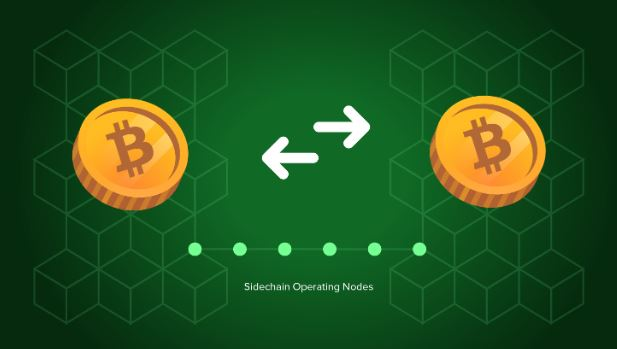

# How do SONs impact me?

You can think of SONs as a two-way street. The value of two blockchain tokens is going back and forth safely and smoothly.

To paint a picture, let’s imagine you’re sending your bitcoin from an address to a sidechain. This bitcoin is then represented on the other side of the new blockchain. You are then able to move this represented bitcoin without touching your original bitcoin.

This offers scalability for bitcoin. For example, let’s say another blockchain can perform 50,000 transactions per second. Now Imagine being able to operate your bitcoin at that speed. This opens up endless possibilities about the applications Bitcoin could be used in.

It could really be the answer for worldwide adoption.
