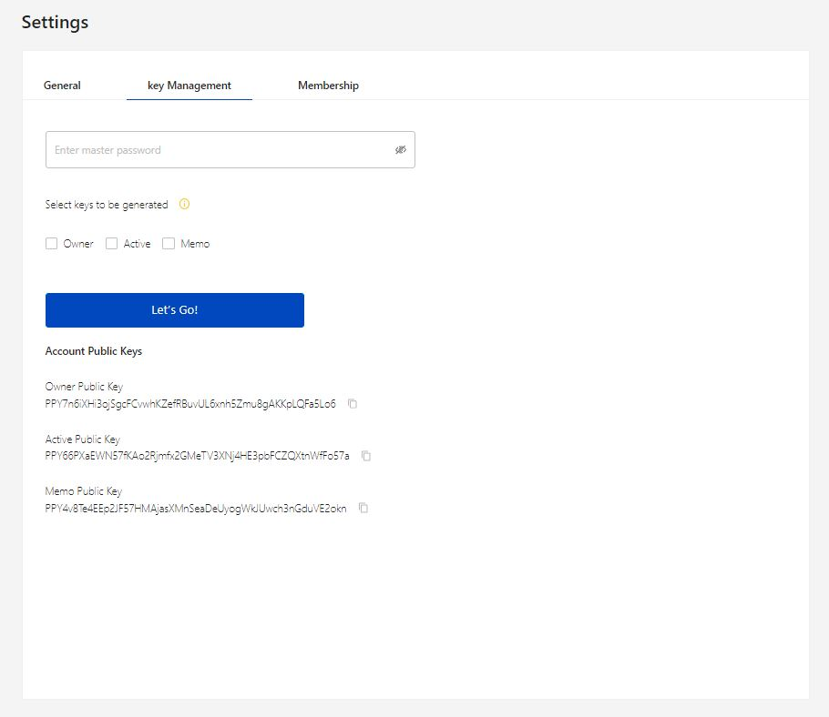

# How do SONs Work?

Hinted through their names, these Sidechains run alongside a root or “parent chain.” When you transfer funds, they're locked on the parent chain and then released onto their respective sidechain. You can then move them around at will until you decide to return them back to their original chain.

Anyone can enable a Sidechain Operating Node. However, that is not enough to run a SON. You must be an ‘active participant’ in the Peerplays community and receive votes in order to qualify to become a SON. Since Peerplays blockchain is Gamified Proof of Stake, this incentivizes voting for those who run SONs.

Once a SON finds a particular transaction which is signed by 2/3rd of other SONs, that SON will post the transaction to the Peerplays blockchain. Upon receiving the transaction, the SON will verify the transaction details with the appropriate blockchain. If the data on the source blockchain sidechain seems to be intact, the SON will sign the transaction and publish it. This helps prevent any SON from malicious transactions.
