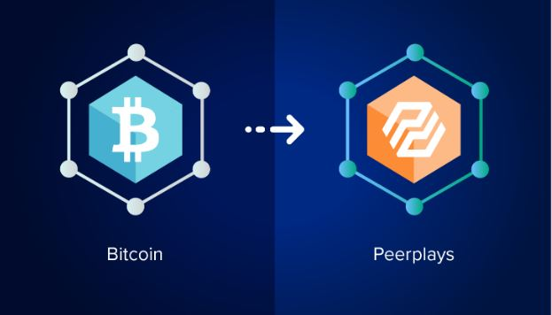

# What are Sidechain Operating Nodes?

In order to improve the performance of Bitcoin and Ethereum, a unique mechanism is required. Sidechains can help move tokens, perform transactions faster and cheaper.

Sidechains provide the [decentralized ](../../../concepts/decentralization.md)way to seamlessly transfer value between multiple blockchains and to operate Sidechain SONs node are used.

Sidechain Operating Nodes (SONs) means a lot to the blockchain world. SONs provide a way for blockchains to interact with each other. Those nodes are in harmony with each other like a handshake which ease the process of transferring tokens from Peerplays blockchain to and from another blockchain.

Sidechains solve a problem known as Inter-Blockchain Communication (IBC). This problem takes place when blockchains have different protocol types (also called consensus mechanisms, like Proof of Work, Proof of Stake, Delegated Proof of Stake, etc.)

Peerplays SONs are decentralized, trustless, and elective.
