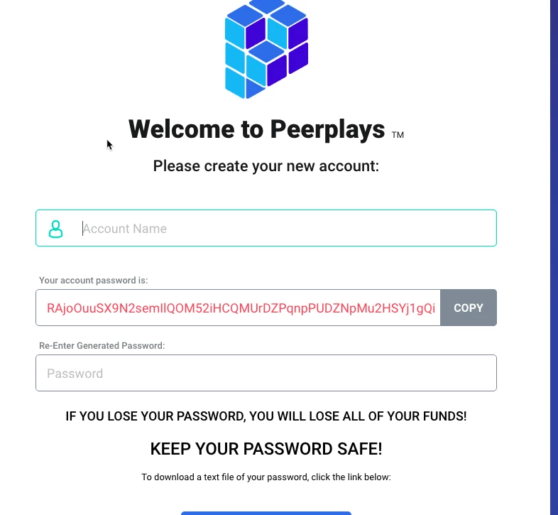

# Creating a witness account

For given network, say MAINNET or TESTNET we need to first create a user account using a faucet. 


**Faucet ?!**

In the blockchain world, account creation services are nicknamed as faucents. They create unique Network Address Identifiers.


To create a Peerplays MAINNET account, the easiest way is to use the GUI wallet available to download from [Github](https://github.com/peerplays-network/peerplays-core-gui/releases).

Creating user in Peerplays GUI wallet is self explanatory.

#### 2. Upgrading the Peerplays account to a witness account

We can do this from the `cli_wallet` & this includes multiple steps.

1. Buy some PPY \(or ask your friendly whale!\) from an exchange
2. Upgrade your new account to a Life Time Member \(LTM\)
3. register and update the witness to the network

For the first step, we need to access the newly created Peerplays account from the cli\_wallet. Instructions are given in the next section.

#### 3. Using password generated in GUI wallet in _cli\_wallet_

In the Graphene based blockchains like Peerplays the hierarchical permissions like fund transfer, sending memo etc are separated using different roles and Public-Private key-pairs for each role. We have 3 types of roles OWNER, ACTIVE and MEMO. These keys are generated using a brain key.

The password auto generated by the wallet is a brain key. And the brain key is used to generate various key-pairs in the Wallet Import Format \(WIF\).


_**WIF = SHA256\( username + role + brain key\)**_

example:

OWNER WIF = SHA256\(peerplays user name + owner + brain key\)




The above brain key belongs to the user _t3st123_

Note that the above password is not the private or public key. So we need to create the key pairs to be used in the `cli_wallet` using the method `get_private_key_from_password`

* To generate the OWNER keypair, use the following command

```cpp
get_private_key_from_password t3st123 owner RAjoOuuSX9N2semIlQOM52iHCQMUrDZPqnpPUDZNpMu2HSYj1gQi
```

**Result:**

_unlocked &gt;&gt;&gt; get\_private\_key\_from\_password t3st123 owner RAjoOuuSX9N2semIlQOM52iHCQMUrDZPqnpPUDZNpMu2HSYj1gQi get\_private\_key\_from\_password t3st123 owner RAjoOuuSX9N2semIlQOM52iHCQMUrDZPqnpPUDZNpMu2HSYj1gQi \[ "PPY5xmkfRJhsG54kxNpoBtWqnEpScGBxczooapTbCpmetFAmzUvJ1", "5KPHKeuqRyNfuc32LGDzc6tqcCPzyLgfguQzN4Xkrys3VfMxtjB" \]_

###  <a id="UsingpasswordgeneratedinGUIwalletincli_wallet-Instructions"></a>

ACTIVE & MEMO keys also can be obtained in the same way.

